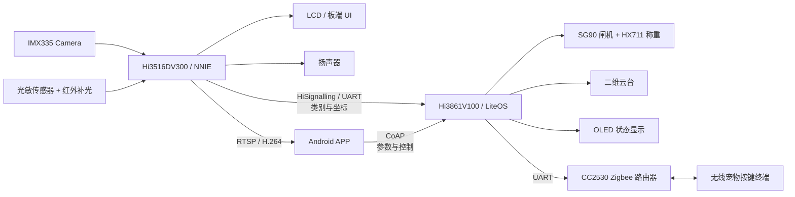

## 摘要

宠物服务设备如果只有定时投喂，本质上只是一个带时钟的粮仓：它能按时落粮，却不知道有没有宠物靠近、来的是什么宠物，也无法把识别结果转化为可靠的称重投喂、云台跟随和远程交互。本项目围绕这一问题，实现了一套由 AI 子系统、IoT 子系统、电源子系统、Android APP 和喂食器实体组成的 AIoT 宠物服务系统。

AI 子系统以 Hi3516DV300 为核心，运行 Ubuntu，使用 YOLOv2 检测网和 ResNet18 分类网识别猫狗；模型经过 Caffe 转换、RuyiStudio 量化后，以 NNIE 可执行的 `.wk` 文件部署到板端。系统在识别结果基础上完成视觉感知、语音引导、目标跟随、夜间识别、RTSP 推流和本地拍照。IoT 子系统以 Hi3861V100 为核心，运行 LiteOS，负责称重投喂、二维云台、Zigbee 宠物按键、CoAP 控制和显示等任务。Hi3516 与 Hi3861 以 UART + HiSignalling 协议互联，APP 分别通过 RTSP 获取实时视频、通过 CoAP 下发控制命令。

| 项目项 | 内容 |
| --- | --- |
| 项目名称 | 基于 AIoT 的一体化宠物服务系统 |
| 项目角色 | 独立开发 |
| AI 平台 | Hi3516DV300 / Ubuntu / NNIE |
| IoT 平台 | Hi3861V100 / LiteOS |
| 视觉模型 | YOLOv2 检测 + ResNet18 分类 |
| 通信 | RTSP、UART + HiSignalling、CoAP、Zigbee / Z-Stack |
| 项目代码 | [ORI2333/PFS_BOEMV](https://github.com/ORI2333/PFS_BOEMV) |

<!-- more -->

## 1 绪论

### 1.1 研究背景与意义

宠物逐渐从“看家护院的动物”变成家庭成员，陪伴和照护需求随之增加。但主人上班、加班或出差时，定时定量喂食只能解决最基础的供食问题：它无法确认宠物是否出现，无法区分猫狗，无法实时查看状态，也无法处理夜间活动、宠物自主触发等场景。

传统智能喂食设备往往采用单一控制器加定时器的方式。它们能根据预设时间启动电机，却没有感知链路，也没有把“看见宠物”与“实际投喂多少克”连成闭环。要让设备从“定时开闸”变成“根据状态提供服务”，至少需要解决四类问题：

1. **视觉感知**：实时从视频中识别目标，输出类别和位置；
2. **执行反馈**：按实际重量而不是电机转动时间完成投喂；
3. **远程交互**：用户可看视频、改参数、手动干预；
4. **能耗与扩展**：高算力视觉节点不能全天候空转，低功耗节点需要维持按键和基础服务。

因此，本项目并未将所有模块堆在一块主板上，而是将视觉推理与外设控制拆分为 AI 和 IoT 两个子系统。前者负责“看见并判断”，后者负责“可靠执行”，再通过通信协议与电源策略把二者接成完整服务链路。

### 1.2 国内外研究现状

宠物智能硬件的基础形态长期以定时、定量投喂为主，随后逐步加入 Wi-Fi 连接、远程查看和设备控制。此类设备解决了主人不在场时的基本喂食需求，但对“宠物是否到场、是什么宠物、应否触发某项服务”缺乏感知能力。

机器视觉宠物监护和自动喂食是两个已有方向：前者强调视频采集、目标识别和远程观察，后者强调投喂执行、定时控制和计量。毕业论文的切入点是将二者与低功耗物联网控制结合：视觉主机负责识别与视频，IoT 主控负责称重、舵机和无线扩展，APP 提供控制入口。这样，视觉结果不是只留在屏幕上的检测框，而能进入投喂、语音和云台的服务闭环。

### 1.3 本文结构

文章按毕业论文原有的实现顺序组织：第 2 节给出总体方案；第 3 节说明视觉模型训练、转换、量化与部署；第 4 节说明 Hi3516 上的 AI 应用；第 5 节说明 Hi3861、Zigbee 和称重投喂；第 6 节说明供电和低功耗；第 7 节说明 Android APP；第 8 节以真实场景验证各条服务链路。

## 2 系统总体方案设计

### 2.1 需求分析

论文将需求拆为七项功能，并在实现中对应到具体模块：

| 需求 | 对应实现 |
| --- | --- |
| 视觉感知 | Camera、YOLOv2、ResNet18、NNIE |
| 主人声音引导 | 扬声器、类别对应音频、播放限流 |
| 远程控制 | Android APP、CoAP、云台控制 |
| 自定义投喂 | APP 参数、Hi3861、舵机、HX711 |
| 实时视频监控 | H.264 编码、RTSP、APP 解码显示 |
| 目标跟随 | 检测框坐标、UART、二维云台 |
| 宠物自主按键 | 感应开关、CC2530、Zigbee、Hi3861 |

这些需求并非彼此独立。比如目标跟随需要 AI 子系统输出坐标、UART 将坐标或方向命令交给 Hi3861、IoT 子系统再控制云台；无线按键则需要 Zigbee 节点、路由器、Hi3861 的命令解析以及投喂闭环共同工作。系统设计的重点不只是“每个模块能跑”，而是接口之间的责任边界清晰。

### 2.2 可行性分析

**技术可行性。** Hi3516DV300 提供视频采集、编解码和 NNIE 推理能力，能够承担 Camera 画面的处理与模型部署；Hi3861 运行 LiteOS，适合长时间处理 GPIO、PWM、称重、Wi-Fi 和协议消息；CC2530 与 Z-Stack 则为低功耗多节点按键扩展提供基础。三类平台按任务拆分，避免单一控制器同时处理视频推理与实时外设控制。

**经济可行性。** 系统使用成熟的开发板、常见的舵机、HX711、光敏模块和 Zigbee 节点。工程成本主要来自视觉主机、供电、机械结构和开发时间；功能设计优先复用模块化接口，便于单独替换和后续迭代，而不是在原型阶段设计不可维护的一体化硬件。

**应用可行性。** APP 提供用户可理解的投喂、视频、云台和开关配置；宠物按键提供低功耗下的自主触发入口；称重反馈限制单次投喂结果。系统服务的对象是家庭宠物照护，视觉识别仅用于猫狗类别和位置判断，不替代健康诊断或兽医判断。

### 2.3 总体架构分析

#### 2.3.1 系统结构

系统由 AI 子系统、IoT 子系统、电源子系统、APP 和喂食器实体组成。Taurus 开发套件以 Hi3516DV300 为核心，Pegasus 开发套件以 Hi3861V100 为核心。Taurus 负责视频、模型和语音；Pegasus 负责称重、舵机、云台、OLED、Zigbee 和参数控制。

#### 2.3.2 系统整体实现设计

从软件和硬件两侧看，系统有两条主数据流：

1. **视频流**：Camera 采集图像 → Hi3516 编码/推理 → RTSP 推给 APP，同时在 LCD 上显示；
2. **控制流**：识别结果或 APP 指令 → Hi3861 → 舵机、称重、云台、Zigbee 与显示模块。

Hi3516 侧的视频处理不是孤立的模型 demo。检测和分类结果会以类别、置信度、边界框等形式参与后续逻辑：类别用于区分猫粮/狗粮和语音文件，目标框坐标用于云台跟随。Hi3861 侧也不只是“收命令转 PWM”，它在投喂过程中持续读取 HX711，根据实际重量决定闸机关闭时机。

APP 同时连接两个逻辑服务：RTSP 客户端获取 Hi3516 输出的视频；CoAP 客户端向 Hi3861 设置克数、投喂间隔、自动跟随和宠物按键等参数。视频流和控制流分开，避免带宽与控制消息相互干扰。

#### 2.3.3 系统模块设计（电路连接）

电路上，AI、IoT、电源和喂食器实体独立成块。Taurus 连接 Camera、扬声器、光敏与红外补光、LCD；Pegasus 连接 OLED、两个投喂通道、称重模块、云台和 Zigbee 路由器。Taurus 与 Pegasus 使用 UART 互联；Zigbee 路由器同样通过 UART 接入 Pegasus。

模块化连接的好处是故障定位相对直接：视频识别异常优先检查 Taurus 与模型，重量不准优先检查 HX711 和闸机，远程控制失效则检查 CoAP、Wi-Fi 和 Hi3861。相比所有功能共享一套不可替换的板级逻辑，模块边界更适合后续维护。

### 2.4 创新点

系统的特点不是单独采用了某个深度学习模型，而是把模型结果放进实际服务闭环：

- YOLOv2 与 ResNet18 结合，完成目标位置和类别判断；
- 识别类别可触发对应主人语音；
- 识别框坐标驱动云台跟随；
- 识别、无线按键和 APP 三种触发方式共用称重投喂闭环；
- Zigbee 让宠物在低功耗模式下仍有自主触发入口；
- APP 同时承担视频观察和设备参数配置。

## 3 AI 模型开发与部署

### 3.1 AI 模型训练思路

系统把视觉任务拆为检测网和分类网。检测网负责从整帧画面找出候选的猫狗目标与位置；分类网只处理裁剪后的目标区域，完成更细的猫狗类别判断。拆分后的处理链路为：

$$
\text{Video Frame} \rightarrow \text{YOLOv2 Detection} \rightarrow \text{Crop / Resize} \rightarrow \text{ResNet18 Classification} \rightarrow \text{Class + Box}
$$

这种两阶段结构适合本项目的部署条件。YOLOv2 负责较快定位，ResNet18 负责对目标区域分类；分类网不必在整帧上重复计算。系统最终保留类别和坐标两个核心输出，供显示、语音、跟随和投喂规则使用。

#### 3.1.1 数据集制作

检测网使用猫、狗两类开源数据，每类 8,000 余张。标注采用 Labelme，人工绘制矩形框后得到 JSON 文件；再使用 Python 脚本将 JSON 中的标签和坐标转换为 Darknet 所需的 TXT 标注格式。

分类网使用的猫图约 11,900 张、狗图约 9,544 张。除开源数据外，项目使用 Taurus 的 Camera 录制真实部署视角的视频：录制文件先从板端取回，`H.264` 转为 `MP4`，再使用 FFmpeg 按帧抽取图片。自采集样本让训练集包含实际镜头的视角、背景和距离，而不是只使用干净的公开图片。

数据清理中会排除主体不明确、包含大量人类或其它动物、难以区分猫狗脸部的样本。分类任务中，脸部区域通常比全身区域带来更稳定的分类结果，因此数据制作会尽量保证裁剪区域与部署时检测框的输入分布接近。

#### 3.1.2 模型训练

检测网采用 YOLOv2，训练环境为 Darknet，训练算力使用 NVIDIA Tesla V100。YOLO 训练输出中的 `Region Avg IOU` 用于描述预测框和真实框的重合程度；`Class`、`Obj`、`No Obj` 和 `Avg Recall` 分别反映类别、目标置信度、背景预测和召回等训练状态。论文记录的检测网训练时长约 30 小时，最终检测准确率约为 94%。该结果是训练实验中的检测指标，不应外推为所有家庭环境下的端到端服务成功率。

分类网采用 ResNet18，训练时将猫狗脸部区域作为重点输入。YOLOv2 擅长从整帧找出目标位置，但对复杂背景或目标细节的类别判断存在边界；ResNet18 在裁剪区域上提供额外的类别判断。部署时并非让两个网络平行处理整帧，而是先检测、再裁剪、最后分类。

#### 3.1.3 模型转换

NNIE 部署环境以 Caffe 模型作为输入，因此训练模型需要完成框架转换：

- YOLOv2 的 Darknet `.cfg` 与 `.weights` 通过 `YOLOv2_to_Caffe` 转为 `.prototxt` 和 `.caffemodel`；
- ResNet18 的 PyTorch 模型通过 Pytorch2Caffe 转为 Caffe；
- 转换后需要检查输入尺寸、网络层和权重参数是否符合 NNIE 工具链约束。

模型转换并不是纯文件改后缀。Darknet、PyTorch 和 Caffe 的网络表达和权重格式不同，转换过程可能引入算子适配与精度变化。因此，转换完成后仍需在量化和板端推理前做仿真检查。

#### 3.1.4 模型量化

量化将模型参数和激活表示从浮点形式转换为更适合嵌入式推理的定点表示，以降低模型体积、存储访问和计算开销。项目使用 RuyiStudio 对 Caffe 模型做功能仿真、指令仿真和量化，最后导出 NNIE 使用的 `.wk` 文件。

量化验证关注两类问题：一是量化前后的推理输出是否保持足够一致，可用余弦相似度和最大绝对误差观察；二是量化后的模型是否满足板端内存和执行时间预算。随后可以合并可优化的激活层，减少运行时内存分配。

### 3.2 模型应用

#### 3.2.1 YOLOv2 单独检测

YOLOv2 直接处理视频帧，输出检测框和目标类别信息。它的主要价值是实时定位：只需一次前向推理即可得到多个候选框，适合嵌入式视频流的初筛。识别结果可直接叠加到输出视频，并作为后续业务逻辑的触发条件。

单独使用检测网时，分类输出可能受背景、姿态和目标尺度影响。因此，项目没有把单检测网结果直接作为全部服务决策的唯一依据，而是继续将候选目标送入分类网。

#### 3.2.2 YOLOv2 与 ResNet18 联合判断

联合判断的执行过程如下：

1. 从当前帧中使用 YOLOv2 得到猫狗候选框；
2. 对候选框坐标做源帧到目标帧的转换；
3. 裁剪最大或有效候选区域，并缩放为分类网输入尺寸；
4. 运行 ResNet18 得到猫/狗分类结果；
5. 将类别、置信度和坐标组合成 JSON/消息结果；
6. 在视频帧上绘制框与类别，同时向外设控制逻辑发送结果。

对于多目标画面，系统以较大的目标框作为主要控制对象，使用不同颜色标记主目标和其它候选目标。这样可以防止云台在多个候选框之间频繁切换，降低控制逻辑的抖动。

#### 3.2.3 应用场景边界

两网络串联适合“快速定位 + 对候选区域分类”的需求，但它并不是身份识别系统，也不是宠物健康诊断系统。系统识别的是猫狗类别和位置，不记录单只宠物的长期身份，更不应根据单帧识别结果直接推断疾病、食量是否健康等结论。这些功能需要额外数据、状态模型和长期验证。

### 3.3 AI Plugin 开发与板端部署

板端 AI Plugin 负责接入 `.wk` 模型，并通过插件接口完成模型加载、推理、释放和应用逻辑连接。核心工作包括：

- 在 `Load` 阶段加载检测网和分类网；
- 在 `Cal` 阶段接收视频帧、调用推理并处理输出；
- 在 `Unload` 阶段释放模型和任务缓冲；
- 将推理结果输出给 OSD、UART 消息与其它 AI 应用模块。

仓库的 `Taurus/` 目录提供 HiOpenAIS 的补丁、AI Plugin 源码和部署模型文件。复现需要先搭建对应的 HiOpenAIS 环境，将补丁打入 SDK 后重新构建文件系统，再将 `.wk` 文件复制到插件目录。它是面向特定 SDK 的补丁式工程，而不是普通桌面端一键运行项目。

<!--
配图 10
论文对应：图 3-16 PLUG 接口、图 3-17 加载模型、图 3-18 卸载检测网模型
建议文件名：10-ai-plugin-model-lifecycle.png
用途：建议展示接口与加载/卸载关键代码；适合放在本节末，图片应裁掉无关 IDE 边框。
-->

### 3.4 NNIE 板端推理

NNIE 的典型推理过程包含：获取 `.wk` 文件大小、申请模型缓冲、加载模型、获取任务缓冲需求、申请任务内存、准备输入帧数据、执行 `Forward`、通过 `Query` 查询任务完成状态、读取输出、卸载模型并释放缓冲。

这条生命周期保证了模型内存和任务内存在板端可控。视频帧循环中，检测网先给出候选框，分类网再对目标区域推理；模型和缓冲的管理不应散落在业务逻辑中，否则长时间运行时的内存泄漏和重复加载问题会比模型精度更早出现。

<!--
配图 11
论文对应：图 3-19 NNIE 引擎的板端推理逻辑图
建议文件名：11-nnie-inference-lifecycle.png
用途：展示模型加载、缓冲分配、Forward、Query、释放资源的板端推理生命周期。
-->

## 4 AI 子系统应用设计与实现

### 4.1 AI 应用框架

AI 子系统以 Camera、Hi3516DV300、光敏传感器、红外补光灯、扬声器和 LCD 为基础。模型推理结果驱动五项应用：视觉感知判断、语音、目标跟随、夜间识别和板端拍照。

视觉感知是其余功能的起点：语音模块依据识别类别选择音频；跟随模块依据识别框位置控制云台；夜间模式确保低照度下还能获得可识别画面；拍照模块则让设备能够在本地保存当前画面。

<!--
配图 12
论文对应：图 4-1 AI 应用功能框架
建议文件名：12-ai-subsystem-capability-map.png
用途：展示 Camera、补光、扬声器、LCD 与五项 AI 应用之间的关系。
-->

### 4.2 Hi3516 与客户端 RTSP 推流

RTSP 负责客户端对实时媒体流的会话控制。Hi3516 将 Camera 帧编码为 H.264 码流，RTSP 服务端提供描述、会话建立、播放、暂停和关闭等控制能力；APP 侧使用 FFmpeg 接收并解码码流，`MediaCodec` 与 `SurfaceView` 负责显示。

工程链路可简化为：

$$
\text{Camera} \rightarrow \text{H.264 Encoder} \rightarrow \text{RTSP Server} \rightarrow \text{Wi-Fi/TCP} \rightarrow \text{FFmpeg Decoder} \rightarrow \text{SurfaceView}
$$

视频端设置缓存以缓冲网络抖动。使用 TCP 有利于传输可靠性，但可能增加延迟；该取舍适用于本项目的远程观察和控制场景。视频流不与 CoAP 控制消息共用一条业务链路，避免码流带宽影响投喂和云台指令。

<!--
配图 13
论文对应：图 4-2 RTSP 推流协议实现、图 4-3 RTSP 实现效果图
建议文件名：13-rtsp-streaming-and-app-preview.png
用途：以图 4-3 的 APP 实时预览效果为主图，图 4-2 作为协议流程小图。
-->

### 4.3 应用功能实现

#### 4.3.1 视觉感知判断

视觉感知的主流程是：Camera 启动后，NNIE 从视频流中取帧；检测网判断是否存在猫狗；存在目标时，框出脸部/目标区域并送入分类网；分类网输出猫或狗，系统再将类别、置信度和坐标写入视频 OSD 与控制消息。

未检测到目标时，该帧不触发投喂、语音或云台动作。检测到多个目标时，系统选择主要目标用于后续控制，避免每个框都生成一套彼此冲突的舵机命令。

<!--
配图 14
论文对应：图 4-4 视觉感知判断逻辑流程图、图 4-5 Camera
建议文件名：14-visual-perception-flow-and-camera.png
用途：流程图为主，Camera 硬件实物作为角标或右侧配图。
-->

#### 4.3.2 语音功能

语音功能播放预先录制的主人声音，引导宠物靠近食槽。程序不会在每一帧检测到宠物时都播放音频，而是检查帧计数、置信度阈值和类别变化：只有达到设定间隔、识别分数足够且当前类别发生有效变化时，才调用播放函数。

这一限流逻辑避免了高帧率视频导致反复播放。论文实现中，狗和猫使用不同的类别编号与音频文件，扬声器根据最终分类结果选择对应声音。语音的作用是引导，不是对宠物行为做强制控制；投喂仍需满足时间、按键或 APP 等业务条件。

<!--
配图 15
论文对应：图 4-6 扬声器
建议文件名：15-speaker-and-voice-guidance.png
用途：放在语音功能之后；可加一张“猫/狗识别结果 → 对应音频”的自制流程小图。
-->

#### 4.3.3 目标跟随

目标跟随使用检测框坐标控制二维云台。系统将目标框与画面预设边界比较：目标越过左、右、上、下边界时，Hi3516 经 UART 向 Hi3861 发送方向命令；Hi3861 再控制云台的水平或俯仰舵机。目标位于稳定区域时，不额外转动云台。

这种控制策略的实现重点是减少抖动：选择最大候选框作为主要目标，对其它框只做显示；控制命令由目标相对画面边界的位置产生，不需要将视频传到 APP 再由手机下发云台决策。视觉结果直接进入串口控制链路，响应路径更短。

<!--
配图 16
论文对应：图 4-7 目标跟随功能流程图、图 4-8 云台实物图、图 4-9 坐标示意图
建议文件名：16-target-tracking-flow-ptz-coordinate.png
用途：建议三图拼接：左流程，中坐标边界，右二维云台实物。
-->

#### 4.3.4 夜间识别

夜间识别由光敏传感器和红外补光共同实现。系统读取环境亮度，并与设定阈值比较；环境较暗时开启红外补光，调整图像相关属性后继续执行同一套猫狗检测和分类；环境恢复明亮时关闭红外并切回正常模式。

阈值附近的环境亮度可能波动，因此红外状态切换不应只靠单次采样。实现中使用连续计数阈值进行抖动消除，只有状态连续满足条件后才实际切换 IR-Cut 和相关图像属性，避免补光灯频繁开关。

<!--
配图 17
论文对应：图 4-10 夜间识别功能逻辑流程图、图 4-11 光敏传感器和红外补光灯、图 8-6 夜视效果
建议文件名：17-night-vision-flow-hardware-result.png
用途：三图组合，实际夜视识别结果放最大；流程和硬件图作为辅助。
-->

#### 4.3.5 板端拍照

板端拍照基于 HiGV 图形框架完成。用户可以在 LCD/触摸屏上进入拍照界面、触发拍照、预览、保存、浏览图库和删除图片。视频帧通过 VPSS 处理后送往 LCD 显示；触发拍照时，当前帧交由 JPEG 编码器保存到 eMMC。

它与 APP 端视频预览不同：APP 负责远程实时观看，板端拍照负责本地独立保存和管理图像。两者使用不同的交互入口，但共享 Camera 产生的视频帧。

<!--
配图 18
论文对应：图 4-12 板端拍照功能、图 4-13 板端拍照示意图、图 8-7 板端拍照效果
建议文件名：18-on-device-photo-capture.png
用途：以图 8-7 的实际效果为主图，图 4-12 的状态流程为小图。
-->

## 5 IoT 子系统应用设计与实现

### 5.1 多设备协同设计

IoT 子系统需要同时接收视觉命令、APP 参数和 Zigbee 按键事件，再控制舵机、称重、云台和显示。因此，通信链路按数据性质拆分：

| 链路 | 数据 | 实现 |
| --- | --- | --- |
| Taurus ↔ Pegasus | 类别、坐标、执行命令 | UART + HiSignalling |
| Pegasus ↔ Zigbee 路由器 | 按键与扩展节点消息 | UART |
| Zigbee 路由器 ↔ 终端 | 无线感应按键 | CC2530 + Z-Stack |
| APP ↔ Pegasus | 配置与控制 | Wi-Fi + CoAP |
| Taurus → APP | 实时视频 | Wi-Fi + RTSP |

Taurus 与 Pegasus 分工明确：Taurus 负责视频理解，Pegasus 负责实际控制。即使 AI 模型更换，称重投喂和 Zigbee 链路的控制模型也无需跟着重写；即使视觉主机关闭，低功耗控制侧仍可以保持基本服务。

<!--
配图 19
论文对应：图 5-1 多设备通信设计方案
建议文件名：19-multidevice-communication-topology.png
用途：展示 UART、RTSP、CoAP 和 Zigbee 四条通信链路的分工。
-->

### 5.2 多设备通信实现

#### 5.2.1 Hi3516 与 Hi3861 通信

Taurus 和 Pegasus 通过 UART 连接，使用 HiSignalling 协议封装控制数据。发送端将业务数据写入帧体，添加 `0xAA 0x55` 帧头、`0xFF` 帧尾并计算 CRC32；接收端完成 CRC 校验后再将命令分发给云台、投喂或其它控制模块。

这种协议封装比直接发送裸字节更适合长期运行。视觉侧可能输出不同类别、不同坐标和不同控制状态，帧头、长度、帧尾与 CRC 让接收侧能够从串口字节流中识别完整消息并拒绝损坏数据。

#### 5.2.2 Hi3861 与 Zigbee 通信

Hi3861 与 Zigbee 路由器通过 UART 双向通信。Hi3861 发送控制或配置数据给路由器；路由器接收终端上报的按键事件后，经 UART 交给 Hi3861。路由器侧使用 TI UART 库接收字节流，再将完整消息交给 Z-Stack 的处理函数。

这条链路让 Zigbee 网络与主控应用解耦：Hi3861 只需处理统一的事件数据，不需要理解每一个终端设备的无线链路细节；Zigbee 节点也不必直接承担投喂、称重等业务逻辑。

#### 5.2.3 Zigbee 组网通信

Zigbee 使用 CC2530 和 Z-Stack。一个节点承担协调/路由角色，配置网络信道、PAN ID 等参数；两个终端节点连接非接触式感应开关，加入网络后在触发时上报状态。路由节点解析来源设备与状态，再将消息转发给 Hi3861。

Zigbee 的价值并不局限于一个宠物按键。它提供的是低功耗、多节点的扩展入口：未来可以按同一模式接入饮水、照明、环境传感器或额外按键，而无需让所有外设都直接挂在主控 GPIO 上。

#### 5.2.4 Hi3861 与客户端 CoAP 通信

Hi3861 提供 Wi-Fi 接入能力，APP 与其建立 CoAP 通信。APP 发出投喂、云台或参数设置请求，Hi3861 的 CoAP 资源处理函数解析请求、执行相应动作并返回响应。控制数据的体量小、请求语义明确，适合由 MCU 常驻处理。

视频没有放在 CoAP 通道中，而是由 Hi3516 的 RTSP 服务承担。这样的职责划分保证了 Hi3861 不必处理高码率视频，也使 APP 的视频播放问题不会直接影响投喂与云台命令。

### 5.3 应用功能实现

#### 5.3.1 称重闭环投喂

投喂支持三类触发条件：设定时段内识别到宠物靠近、设定时段内触发无线按键、或 APP 手动启动。用户通过 APP 预设单次投喂克数和投喂间隔；触发条件满足后，Hi3861 打开对应食物仓的舵机闸门，食物落入食槽，HX711 持续采样重量；达到设定值后关闭闸门。

投喂控制的核心不是“让舵机转动”，而是“让食物重量收敛到目标值”。不同粮食颗粒、仓内余量、闸机机械摩擦都会影响下料速度。若只按开闸时间估计粮量，误差会累积；用 HX711 作为反馈，系统可以按实际重量决定关闭时机。OLED 用于显示实时称重等状态。

<!--
配图 20
论文对应：图 5-3 投喂功能流程、图 5-4 SG90 舵机、图 5-5 HX711 传感器、图 8-1 识别投喂效果
建议文件名：20-feeding-weight-feedback-result.png
用途：以图 5-3 流程和图 8-1 成果为主，SG90/HX711 实物做辅助；说明从触发到称重关闸的完整闭环。
-->

#### 5.3.2 云台自转功能

二维云台由两个舵机实现水平和俯仰转动。Hi3861 可以接收来自 Hi3516 的自动跟随命令，也可以接收 APP 的手动上、下、左、右和复位命令。二者应共享同一套云台状态和优先级规则，避免 APP 手动控制与自动跟随在同一时刻发送相反的方向命令。

在文章对应的系统测试中，目标跟随与 APP 手动控制分别验证：前者验证视觉坐标到舵机动作的自动链路，后者验证用户通过 APP 到 CoAP 再到云台的远程链路。

<!--
配图 21
论文对应：图 5-6 云台、图 8-2 目标跟随功能、图 8-3 APP 查看实时视频和远程控制
建议文件名：21-ptz-auto-and-manual-control.png
用途：建议放成三图组合：云台实物、自动跟随、APP 手动控制。
-->

#### 5.3.3 宠物拓展按键功能

宠物拓展按键由非接触式感应开关、Zigbee 终端、路由器和 Hi3861 组成。宠物触发感应开关后，终端设备生成事件并通过 Zigbee 上报；路由器转发至 Hi3861；控制侧再根据当前投喂间隔、按键开关状态和系统模式决定是否投喂或唤醒 AI 主机。

从交互角度看，这让宠物获得了在规则约束下的自主触发能力；从功耗角度看，按键可以在视觉主机休眠时维持基础服务。它仍需通过投喂间隔和称重控制约束，不能把“宠物一碰就喂”当作安全策略。

<!--
配图 22
论文对应：图 5-2 Zigbee、图 5-7 宠物拓展按键示意图、图 5-8 非接触式感应开关、图 8-4 Zigbee 模块和宠物无线按键
建议文件名：22-zigbee-pet-button-system.png
用途：以图 8-4 的真实演示为主，搭配图 5-7 的连接示意图；其余硬件图可作为小图。
-->

## 6 电源子系统设计与实现

### 6.1 电源设计

系统支持外部适配器与锂电池两路供电。外部电源一方面经降压模块为系统供电，另一方面用于电池充电；电池通过 LM2596 等降压模块为 Pegasus 及外设供电。三档开关用于选择外部或内部供电路径。

功耗分配决定了供电结构：Taurus 的视频采集、编码和 NNIE 推理是主要功耗来源，论文记录系统最大功率约 18 W，其中 Taurus 部分最高约 15 W。因此，电源设计不能只考虑“能点亮”，还要保证视觉主机启动、云台转动和投喂舵机同时动作时的供电稳定。

<!--
配图 23
论文对应：图 6-1 电源子系统设计框架、图 6-2 12V 转 5V 降压板、图 6-3 LM2596 电源模块
建议文件名：23-power-domain-converters.png
用途：电源框图为主，两个降压模块实物图为辅。
-->

### 6.2 低功耗模式

低功耗模式的基本思路是让高功耗 AI 子系统按需启动，而让 Hi3861 和 Zigbee 节点保持低功耗常驻。夜间或不需要视觉服务时，可以通过继电器关闭 Taurus；宠物按键事件经 Zigbee → Hi3861 后，可执行基础投喂或触发 Taurus 上电。

这不是把 AI 子系统完全移除，而是按业务需要调度。视觉识别、视频监控和自动跟随需要 Taurus；按键触发、状态保持和部分投喂逻辑可以由 IoT 子系统维持。电源策略建立在子系统职责拆分之上，没有这种拆分，低功耗模式只会变成“关机以后什么都不能做”。

## 7 客户端设计与开发

### 7.1 APP 概述

Android APP 名为 `Pet assistant`，是系统的用户控制中心。用户完成设备绑定后，可以在 APP 中查看实时视频、控制云台、手动投喂、设置投喂克数和投喂间隔，并配置无线宠物按键和自动跟随功能。

APP 提供的不是单一遥控器界面，而是将设备接入、视频观察和参数控制组织到同一入口。设备侧的 RTSP 与 CoAP 服务分别承担视频与控制，因此 APP 可以一边显示 Camera 画面，一边下发不会被视频帧阻塞的控制请求。

<!--
配图 24
论文对应：图 7-1 Pet assistant
建议文件名：24-pet-assistant-home.png
用途：作为 APP 章节开头主图，展示软件的主界面和设备控制入口。
-->

### 7.2 操作流程与功能模块

APP 启动后先进入绑定设备流程，可通过扫描二维码或连接到同一 Wi-Fi 的方式绑定设备。绑定成功后进入设备管理页，主要功能包括：

- 手动调节摄像头方向与复位；
- 手动投放猫粮或狗粮；
- 设置单次投喂克数，例如默认值或自定义值；
- 设置投喂间隔，限制短时间内重复触发；
- 开关宠物自主按键；
- 开关摄像头自动跟随。

这些配置经 CoAP 传给 Hi3861，后者将参数写入相应控制逻辑。APP 不应直接假设所有操作都即时成功：网络断开、设备离线、当前处于投喂间隔或称重异常时，控制侧需要返回状态并阻止不安全动作。

<!--
配图 25
论文对应：图 7-2 操作模块图、图 7-3 投喂设置模块和云台控制模块
建议文件名：25-app-control-flow-and-settings.png
用途：操作模块图解释功能分区，图 7-3 展示实际投喂与云台控制界面。
-->

### 7.3 APP 界面

论文展示了连接设备页和设备管理页。连接页解决设备加入问题；设备管理页集中呈现云台、猫粮、狗粮、投喂间隔和自动跟随模块。系统测试中的视频预览与远程控制截图可与这些界面图组合，形成“绑定 → 管理 → 观察/控制”的完整交互说明。

<!--
配图 26
论文对应：图 7-4 连接设备界面、图 7-5 设备管理界面、图 8-3 APP 查看实时视频和远程控制
建议文件名：26-app-binding-management-video.png
用途：建议做 2×2 拼图；连接、设备管理、实时视频与远程控制分别占一个格子。
-->

## 8 系统测试与展示

### 8.1 识别投喂场景

识别投喂测试验证完整自动链路：Camera 采集视频；Hi3516 识别目标并得到猫狗类别；系统满足投喂时间与状态条件后将命令交给 Hi3861；Hi3861 打开对应闸机；HX711 读取重量，达到目标值后关闭闸机。测试应同时观察识别结果、实际粮量和闸机停止状态，而不是只看画面上有没有检测框。

### 8.2 APP 与设备交互场景

APP 测试覆盖实时查看视频、手动控制云台、手动投喂和参数下发。视频应能够通过 RTSP 在 APP 中显示；方向控制应经 CoAP 到达 Hi3861 并驱动云台；投喂设置应能改变后续称重闭环的目标值。该场景验证视频通道和控制通道能并行工作。

### 8.3 无线宠物按键场景

无线按键测试验证感应开关、Zigbee 终端、路由器、Hi3861 和投喂逻辑的连续性。宠物或人工触发按键后，系统应接收事件，并在按键开关状态和投喂间隔允许时执行相应动作。这个测试尤其适合验证低功耗状态下 AI 主机不参与时，基础服务是否仍能工作。

### 8.4 APP 设置参数场景

参数测试覆盖单次投喂克数、投喂间隔、无线按键启用状态和自动跟随启用状态。配置不是只在 APP 界面显示成功，而是要在 Hi3861 侧实际影响闸机、按键事件和云台逻辑；例如设定较长间隔后，重复按键不应连续触发投喂。

### 8.5 夜间识别场景

夜间测试在低照度条件下验证光敏触发、红外补光和模型识别链路。应观察红外是否在连续低亮度后稳定开启，画面是否具备可识别性，以及亮度恢复后是否避免频繁切换。夜视效果图只能证明代表性样本可用，不替代不同环境下的长期识别性能评测。

### 8.6 板端拍照场景

板端拍照测试验证 LCD/触摸屏交互、当前帧 JPEG 编码、eMMC 存储和图库浏览。它证明系统无需依赖 APP 也能在设备端完成拍照、预览和保存，适合作为本地调试与现场记录功能。

<!--
配图 27
论文对应：图 8-1 识别投喂效果、图 8-2 目标跟随功能、图 8-3 APP 查看实时视频和远程控制、图 8-4 Zigbee 模块和宠物无线按键、图 8-5 APP 设置参数界面、图 8-6 夜视效果、图 8-7 板端拍照效果
建议文件名：27-system-test-results-collage.png
用途：这是全文最重要的成果图，建议采用 3×2 或 4×2 拼图。图 8-1、8-2、8-3 放首行且尺寸最大；其余结果图放第二行。
-->

## 9 结束语

本项目完成了从视觉识别到称重投喂、从低功耗按键到 APP 远程交互的 AIoT 宠物服务闭环。Hi3516DV300 与 NNIE 负责在视频流中完成猫狗检测和分类；Hi3861 负责执行、称重、云台和通信；Zigbee 为宠物自主按键提供低功耗扩展入口；RTSP 与 CoAP 分别处理视频与控制；电源策略让高功耗视觉主机可以按需运行。

项目后续可在不推翻现有架构的基础上演进：基于历史摄食量和活动时间建立异常提醒；扩展饮水、温湿度等节点；引入单只宠物识别和更细的行为分析；接入更成熟的家庭 IoT 平台。前提是继续保留现有边界——模型负责感知，低功耗控制负责执行，协议明确传递状态，称重闭环保证投喂结果。

## 代码与复现说明

项目仓库：<https://github.com/ORI2333/PFS_BOEMV>

仓库包含三部分：

- `Taurus/`：Hi3516 侧 AI Plugin、模型文件和 HiOpenAIS 补丁；
- `Pegasus/`：Hi3861 控制侧的 SDK 补丁；
- `APP/`：Android 控制端工程。

Taurus 侧需要搭建相应版本的 HiOpenAIS 环境，应用补丁、重新构建并烧录文件系统；Pegasus 侧需要准备 HiHope WiFi-IoT Hi3861 SDK，将补丁覆盖后用 LiteOS Studio 编译烧录；APP 使用 Android Studio 构建。仓库描述的是面向目标开发板 SDK 的复现过程，不包含可直接替代这些 SDK 和硬件环境的桌面模拟器。
