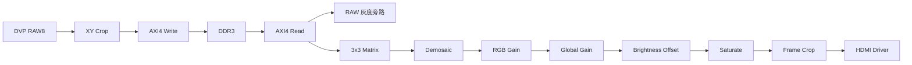
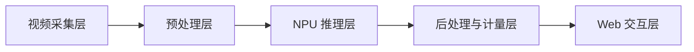
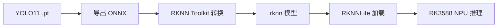
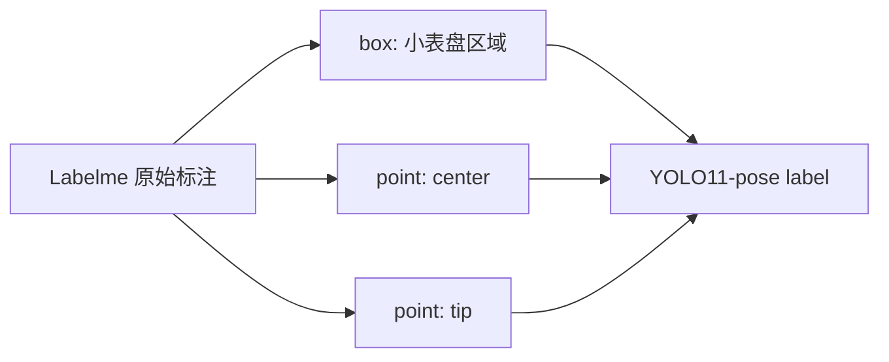
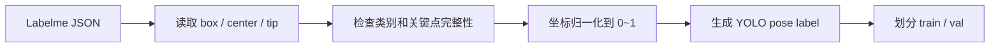
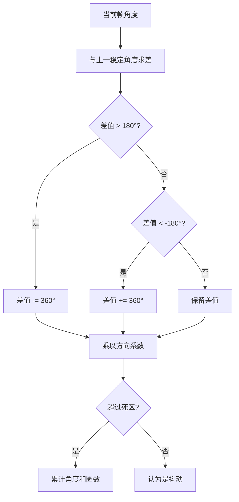
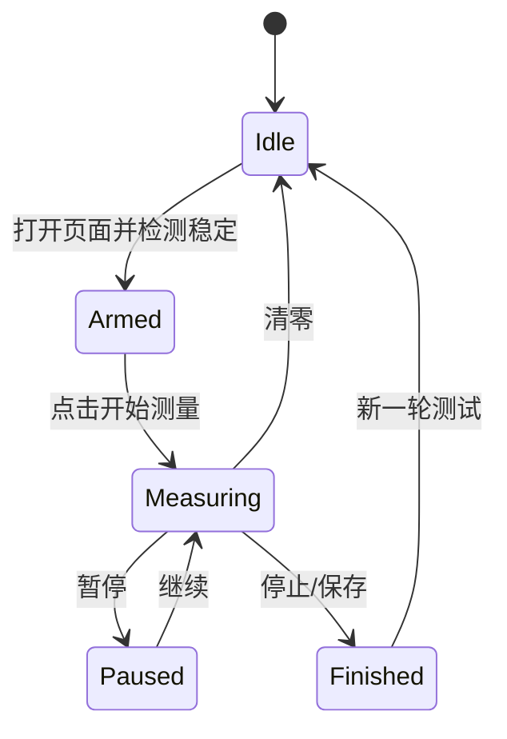
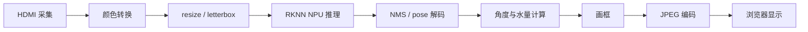

这篇文章记录一个真实硬件项目的端到端搭建过程：前端用 FPGA 接入 SC1336 DVP 相机，完成相机初始化、DDR3 帧缓存、基础 ISP 和 HDMI 输出；后端用 RK3588 接收 HDMI 视频流，调用 YOLO11-pose RKNN 模型检测水表小表盘中心与指针尖端，最后在本地 Web 页面上计算指针角度、累计圈数和经过水量。
<!-- more -->

项目对应的开源整理仓库已经放在 GitHub，文末


这不是一个单纯的“识别水表读数”Demo。真正的目标是动态质检：在某个测试时刻开始计量，让水表实际通水，系统持续观察指针运动，判断水表是否按预期转动，并计算本次经过的水量。也就是说，系统要同时解决成像、视频链路、模型推理、关键点稳定、角度展开、进制换算和 Web 交互这些问题。

## 1. 项目目标

机械水表的质检场景和普通图像识别不太一样。普通读数任务只关心某一帧图片上显示了多少；动态质检更关心“从开始测试到当前时刻，水表实际走了多少”。

因此这个系统被拆成四个目标：
1. 视频链路稳定：FPGA 必须持续输出标准 HDMI，RK3588 必须稳定采集。
2. 画面质量可控：曝光、亮度、白平衡不能让模型输入忽明忽暗。
3. 指针检测稳定：静态水表时关键点不能乱飘，动态时不能丢帧严重。
4. 水量计算正确：四个小表盘是进制关系，不能把四个角度简单相加。

最终希望达到的使用方式很简单：打开 Web 页面，确认水表画面正常，点击开始测量，系统持续显示角度、圈数和本次经过水量。

## 2. 仓库结构

为了把硬件、软件、训练和文档整理到一个可交付工程中，仓库按功能拆成几个目录。

```text
Water-meter-quality-inspection
├── fpga/
│   └── sc1336_hdmi_isp/
│       ├── rtl/
│       └── prj/
├── rk3588/
│   ├── web/
│   └── native/
├── training/
│   ├── configs/
│   └── scripts/
├── tools/
│   └── labeling/
├── docs/
└── README.md
```

对应关系如下：

| 目录                      | 作用                                      |
| ----------------------- | --------------------------------------- |
| `fpga/sc1336_hdmi_isp/` | FPGA 主工程核心文件，包括 RTL、Vivado 工程、约束和 IP 配置 |
| `rk3588/web/`           | RK3588 HDMI 采集、RKNN 推理和 Web 服务          |
| `rk3588/native/`        | RKNN C++ benchmark，用于验证纯推理速度上限          |
| `training/scripts/`     | Labelme 标注整理、YOLO pose 数据集转换、训练辅助脚本     |
| `training/configs/`     | YOLO11-pose 数据集配置                       |
| `tools/labeling/`       | Labelme 辅助启动脚本                          |
| `docs/`                 | 技术文档、使用手册、调试说明和博客稿                         |

仓库没有包含原始数据集、训练权重、ONNX、RKNN、Vivado 生成目录和压缩包。

## 3. 总体架构

系统采用 FPGA + RK3588 的异构架构。FPGA 负责实时视频链路和前端图像预处理，RK3588 负责 AI 推理、Web 展示和水量计算。


从调试角度看，这条链路可以分为两段：


这种分工的好处是边界清楚。FPGA 只需要保证 HDMI 输出是稳定视频，RK3588 就可以把它当成一个普通视频采集源来处理。模型、Web、UI、计算逻辑的迭代不会破坏 FPGA 工程时序。
## 4. 器件选择：为什么 FPGA 和 RK3588 之间选择 HDMI？

FPGA 和 RK3588 之间理论上可以有很多连接方式，比如 MIPI、并口、PCIe、网络或者共享存储。但在这个项目里，HDMI 是比较务实的选择。
HDMI 的优点：
1. 标准化强，FPGA 输出后可以直接接显示器看画面。
2. RK3588 端可以通过视频采集节点读取，软件侧调试简单。
3. FPGA 和 RK 软件边界清楚，前后端可以独立迭代。
4. 出问题时可以快速判断：显示器画面正常而 Web 异常，问题多半在 RK 侧；显示器也异常，先查 FPGA 和相机链路。

HDMI 的缺点也存在：
1. RK 采集到的是经过 HDMI 链路和采集驱动后的图像，不等于 FPGA 内部原始像素。
2. Web 端如果用 MJPEG 推流，还会再次压缩，浏览器看起来可能比 HDMI 直连显示器更糊。
3. 如果要极致低延迟和高画质，后续可以考虑 V4L2 DMABUF、硬件编码或更底层的 C++ 管线。

当前阶段先把工程跑通、把测量闭环做出来，比追求极限视频链路更重要。
PS：后续考虑采用光口或者光转电，全部IP化

从系统类比上看，HDMI 在这里相当于一条“标准视频总线”。FPGA 不需要理解 RK3588 的 AI 软件栈，RK3588 也不需要理解 FPGA 内部的 DVP、DDR 和 ISP 时序。二者只在 HDMI 这一层交接，降低了联调复杂度。对于一个软硬协同项目，这种边界清晰的接口往往比理论上更高效但耦合更深的接口更容易落地。

## 5. FPGA 端设计
FPGA 工程放在：
```text
fpga/sc1336_hdmi_isp/
```
Vivado 工程入口：
```text
fpga/sc1336_hdmi_isp/prj/sc1336_hdmi.xpr
```
关键 RTL：

| 文件 | 作用 |
| --- | --- |
| `rtl/sc1336_hdmi.sv` | 顶层模块，连接相机、DDR3、ISP、HDMI、UART |
| `rtl/i2c_sc1336_config.v` | SC1336 初始化寄存器配置 |
| `rtl/Sensor_Image_XYCrop.sv` | DVP 输入裁剪 |
| `rtl/axi4_ctrl.sv` | DDR3 AXI4 帧缓存读写 |
| `rtl/isp/VIP_RAW8_RGB888.v` | RAW8 Bayer 转 RGB888 |
| `rtl/isp/VIP_Matrix_Generate_3X3_8Bit.v` | 3x3 窗口生成 |
| `rtl/isp/Line_Shift_RAM_8Bit.v` | 行缓存 |
| `rtl/isp/FrameBoundCrop.v` | 输出边界裁剪 |
| `rtl/uart_rx.v` / `rtl/uart_tx.v` | 串口调试入口 |

### 5.1 相机输入

当前使用的是 SC1336 DVP 相机。DVP 输入信号主要包括：

| 信号 | 说明 |
| --- | --- |
| `cmos_pclk` | 像素时钟 |
| `cmos_vsync` | 帧同步 |
| `cmos_href` | 行有效 |
| `cmos_db[7:0]` | 8-bit RAW 数据 |
| `cmos_scl/cmos_sda` | I2C 配置 |
| `cmos_xclk` | FPGA 输出给相机的主时钟 |

相机输出的是 RAW8 Bayer 数据。此时图像还不是 RGB，直接显示只能看到灰度或马赛克效果。想要给 RK3588 和模型一个更接近自然图像的输入，需要在 FPGA 侧做基础 ISP。
#### 为什么使用 DVP 接口

DVP 可以理解为最直接的并行相机接口：相机用 `pclk` 一拍一拍送出像素，用 `vsync` 告诉 FPGA 一帧开始或结束，用 `href` 告诉 FPGA 当前行是否有效，用 8 位数据总线送出像素值。它不像 MIPI CSI 那样需要高速差分 PHY 和复杂协议解析，对 FPGA 入门和快速验证更友好。

在本项目里选择 DVP 的原因主要有四点：
1. 当前 SC1336 模组本身提供 DVP 输出，硬件链路直接可用。
2. FPGA 侧可以用普通 IO 接收，方便用示波器或 ILA 观察 `pclk/vsync/href/data`。
3. 数据时序清楚，便于先把 RAW 灰度链路跑通，再逐步加入 DDR 和 ISP。
4. 水表质检对分辨率和帧率的需求可控，不需要一开始就引入 MIPI 的复杂度。

它的缺点也很明确：并行线多、抗干扰能力不如差分高速接口、走线和时序约束更敏感。如果后续做更高分辨率或更长距离传输，MIPI、GMSL、FPD-Link 或网络视频会更合适。但在当前参考工程阶段，DVP 的可观察性和调试效率更重要。


哈哈哈主要是K7接MIPI口很麻烦，需要自己手动花电路，原生不支持MIPI~

#### 为什么相机输出是 RAW 图

图像传感器本质上不是直接感知 RGB 三通道。它的像素上覆盖了 Bayer 彩色滤波阵列，每个物理像素只感知 R、G、B 其中一种颜色。相机输出 RAW8 时，每个像素只有一个 8 bit 强度值，颜色信息需要根据 Bayer 排列和邻域像素推导出来。

可以把 RAW 图理解成“还没冲洗的底片”：它保留了传感器最原始的采样结果，但人眼不能直接把它当成正常彩色图看。RAW 转 RGB 的过程就是 ISP 中的去马赛克。对于模型来说，直接喂 RAW 灰度也能跑，但表盘、指针、刻度、反光区域的区分度会差一些；转成 RGB 并做亮度/白平衡调节后，模型输入更接近训练数据，关键点会更稳定。

本项目保留 RAW 灰度模式，是为了调试。只要 RAW 模式正常，就说明相机、DVP 接收和 DDR 基础链路大概率没问题；如果 RGB 模式异常，再集中查 Bayer 相位、3x3 窗口和 ISP 参数。

### 5.2 为什么 DDR3 中存 RAW8

这个工程选择把 RAW8 写入 DDR3，而不是把 RGB888 写入 DDR3。
这样做的主要原因是带宽和调试稳定性：
1. RAW8 每个像素 8 bit，RGB888 每个像素 24 bit，RAW8 对 DDR 压力更小。
2. 原始灰度链路更容易先跑通，后续 ISP 可以挂在读出侧。
3. 串口模式可以随时切回 RAW 灰度，快速判断相机和 DDR 是否正常。
4. 对水表检测任务来说，基础去马赛克和亮度调节已经足够支撑模型输入。
FPGA 内部数据流可以理解为：



#### 为什么需要 DDR3 帧缓存

相机输入和 HDMI 输出属于两个不同节奏的世界。相机按照自己的 `pclk/vsync/href` 输出像素，HDMI 按照显示时序要求稳定读出像素。两边即使分辨率接近，时钟、消隐区、启动时刻也不可能完全同步。

DDR3 帧缓存的作用就是在中间做“蓄水池”：

```text
相机侧：按 DVP 时序把像素写入 DDR
显示侧：按 HDMI 像素时钟从 DDR 读出像素
```

类比一下，相机像一台不均匀送货的传送带，HDMI 像一个必须准点发车的地铁系统。DDR3 就是仓库，前端来了就先入库，后端按固定节奏取货。没有这个仓库，两个时钟域直接硬接，很容易出现撕裂、丢行、画面抖动或花屏。

#### AXI4 在这里做什么

DDR3 控制器通常不会直接暴露“写某个脚位、读某个脚位”这种简单接口，而是提供类似 AXI4 的标准总线接口。AXI4 的价值在于把高带宽存储访问抽象成统一协议，包括地址、数据、突发长度、握手和响应。

AXI4 可以理解成 FPGA 内部访问 DDR 的“高速公路规则”：

| 通道 | 作用 | 类比 |
| --- | --- | --- |
| AW | 写地址通道 | 告诉仓库我要往哪里写 |
| W | 写数据通道 | 真正把货送进去 |
| B | 写响应通道 | 仓库确认收货 |
| AR | 读地址通道 | 告诉仓库我要从哪里读 |
| R | 读数据通道 | 仓库把货发出来 |

在视频场景里，AXI4 的 burst 传输非常重要。像素是一整行一整帧连续访问的，如果每个像素都单独发一次地址，效率会很低；使用突发读写可以让 DDR 连续搬运一段数据，提高带宽利用率。

本项目中的 `axi4_ctrl.sv` 主要承担三件事：
1. 把 DVP 输入侧像素组织成连续写请求。
2. 按 HDMI 显示侧需要的地址顺序发起读请求。
3. 在写侧和读侧之间处理帧地址、行地址、突发长度和 FIFO 缓冲。

所以 AXI4 并不是一个“额外功能”，而是 FPGA 使用 DDR3 做视频帧缓存的核心数据搬运协议。视频链路能否稳定，除了 DDR IP 本身，AXI4 读写节奏和跨时钟缓冲同样关键。
### 5.3 ISP

当前 FPGA 侧 ISP 重点不是做复杂画质算法，而是解决模型输入的几个刚需：
1. RAW8 转 RGB888。
2. 白平衡可调。
3. 全局增益可调。
4. 亮度偏移可调。
5. 裁掉边界异常像素。

ISP 可以理解为“把传感器能看的图，变成人和模型都更容易理解的图”。相机 RAW 数据非常原始，亮度、颜色、噪声、边界和动态范围都不一定适合直接显示或推理。完整 ISP 可以包含黑电平校正、坏点修复、去马赛克、白平衡、颜色校正、Gamma、降噪、锐化、自动曝光等很多环节。当前 FPGA 工程只实现了对水表检测最关键、硬件代价可控的几项。

| ISP 环节 | 本项目作用 | 如果没有它会怎样 |
| --- | --- | --- |
| 3x3 窗口 | 为 Bayer 去马赛克提供邻域像素 | 只能显示灰度或马赛克 |
| RAW8 -> RGB888 | 把单通道 Bayer 转成三通道 RGB | 模型输入颜色信息不足 |
| Bayer 相位选择 | 匹配传感器 R/G/B 排列 | 颜色会偏紫、偏绿或完全错乱 |
| 白平衡 | 调整 R/G/B 通道比例 | 现场光源变化时颜色偏移 |
| 全局增益 | 整体提升或降低亮度 | 暗光下模型看不清 |
| 亮度偏移 | 对 RGB 做统一加减 | 细调画面明暗 |
| 饱和限幅 | 防止计算结果超过 8 bit | 高亮区域溢出变色 |
| 边界裁剪 | 去掉 3x3 窗口边界异常 | 图像边缘出现异常线条 |

去马赛克是 ISP 的第一道关键步骤。Bayer 阵列中每个位置只有一种颜色，算法需要根据周围像素估算缺失的两个通道。例如某个红色像素点，需要参考附近的绿色和蓝色采样点推算完整 RGB。这里使用 3x3 窗口，是因为硬件实现相对简单、资源可控，也足够支撑水表检测。

白平衡的作用可以类比手机拍照里的“色温校正”。同一个白色物体，在冷光源下偏蓝，在暖光源下偏黄。模型训练时如果多数图片颜色比较正常，上板后画面严重偏色，就会影响检测稳定性。通过 UART 调 R/G/B 增益，可以在现场快速把画面调回更适合识别的状态。

全局增益和亮度偏移都能让画面变亮，但含义不同。全局增益是乘法，会放大像素差异；亮度偏移是加法，会整体抬高黑位。暗光场景下二者需要配合使用，但不能无限增大，否则噪声和高光溢出都会变严重。

增益使用 Q8.8 表示：

```text
256 = 1.00x
320 = 1.25x
384 = 1.50x
512 = 2.00x
```

像素处理逻辑：

```text
R1 = R0 * R_GAIN / 256
G1 = G0 * G_GAIN / 256
B1 = B0 * B_GAIN / 256

R2 = R1 * ALL_GAIN / 256
G2 = G1 * ALL_GAIN / 256
B2 = B1 * ALL_GAIN / 256

R_OUT = saturate(R2 + BRIGHTNESS)
G_OUT = saturate(G2 + BRIGHTNESS)
B_OUT = saturate(B2 + BRIGHTNESS)
```

这里的 `saturate` 是限幅，避免加亮或增益后溢出 8 bit。硬件上乘法和加法需要做流水线，否则容易把 HDMI 像素时钟域的组合路径拉长。
### 5.4 串口调试场景
FPGA 端做了 UART 可切换测试场景。能把问题定位拆开。

| 命令  | 现象           | 作用                  |
| --- | ------------ | ------------------- |
| `L` | HDMI/LCD 测试图 | 验证 HDMI 显示链路        |
| `D` | DDR 动态测试图    | 验证 DDR 写读和读出节奏      |
| `R` | 相机 RAW 灰度    | 验证 SC1336 输入        |
| `I` | RGB 去马赛克     | 验证 Bayer 相位和 RGB 处理 |
| `C` | 检测推荐模式       | RGB + 白平衡/亮度 + 裁剪   |
|     |              |                     |

常用 ISP 调参：

```text
a / z  全局增益增加 / 减少
+ / -  亮度增加 / 减少
w      恢复默认白平衡和亮度
r / f  红色增益增加 / 减少
g / v  绿色增益增加 / 减少
b / n  蓝色增益增加 / 减少
```

调试顺序建议是 `L -> D -> R -> I -> C`。如果 `L` 都不正常，就不要看模型；如果 `R` 正常但 `I` 颜色不对，重点查 Bayer 相位；如果 HDMI 显示器正常但 Web 模糊，重点查 RK 采集和 Web 推流。

#### L测试 HDMI/LCD 测试图

#### D测试 DDR 动态测试图

#### R测试 相机 RAW 灰度

#### I测试 RGB 去马赛克

#### C测试 检测（白平衡）


### 5.5 暗光延迟问题
调试时出现过一个很典型的现象：正常光照下画面显示和检测都正常，一到暗光环境，画面就出现严重延迟和拖影。

这个问题的根因通常不是 RKNN 慢，也不是 Web 慢，而是相机自动曝光把曝光时间拉得太长。曝光时间越长，单帧积分时间越长，运动指针就会出现拖影，用户看到的现象就是“延迟很大”。

解决方向：
1. 限制 SC1336 最大曝光时间。
2. 用 FPGA 的全局增益和亮度补偿暗部。
3. 给水表加稳定补光。
4. 后续加入 Gamma、对比度增强和锐化。
对于动态质检来说，实时性和边缘清晰度比单纯把画面提亮更重要。
## 6. RK3588 端设计

RK3588 端代码放在：
```text
rk3588/web/
```

主要文件：

| 文件 | 作用 |
| --- | --- |
| `hdmi_yolo11_pose_web.py` | Web 服务、MJPEG 视频流、控制接口、水量计算 |
| `hdmi_yolo11_pose_detect.py` | HDMI 采集 + YOLO11-pose RKNN 推理 |
| `hdmi_rknn_detect.py` | 早期 HDMI RKNN 检测脚本 |
| `usb_rknn_detect.py` | USB 摄像头测试脚本 |
| `convert_best_to_rknn.py` | ONNX/RKNN 转换辅助 |
| `debug_compare_int8_outputs.py` | INT8 输出对比调试 |
| `run_hdmi_yolo11_pose_web.sh` | RK3588 端启动脚本 |

推荐部署目录：
```text
/home/demo/water_meter/
├── code/
│   ├── hdmi_yolo11_pose_web.py
│   ├── hdmi_yolo11_pose_detect.py
│   └── convert_best_to_rknn.py
├── module/
│   ├── water_meter_yolo11n_pose_fp.rknn
│   └── int8_variants/
│       └── water_meter_yolo11n_pose_int8_headrs_float_normal.rknn
└── run_hdmi_yolo11_pose_web.sh
```

启动方式：
```bash
cd /home/demo/water_meter
./run_hdmi_yolo11_pose_web.sh
```

浏览器访问：
```text
http://<RK3588-IP>:6008/
```

RK3588 侧可以理解为四层：



每一层的设计目标不同：

| 层级 | 主要任务 | 为什么这样拆 |
| --- | --- | --- |
| 视频采集层 | 从 HDMI 采集节点持续拿帧 | 和模型解耦，方便替换 USB/HDMI/网络视频源 |
| 预处理层 | BGR/RGB 转换、resize、letterbox | 模型输入尺寸固定，必须统一格式 |
| NPU 推理层 | RKNNLite 调用 RK3588 NPU | 把卷积计算交给专用硬件 |
| 后处理层 | 解码检测框、关键点、NMS、角度 | 模型输出不是最终业务结果 |
| Web 层 | 视频流、状态接口、控制接口 | 现场操作需要浏览器可视化 |

类比一下，FPGA 侧像“前端摄像和视频信号处理设备”，RK3588 侧像“边缘 AI 工控机”。RK3588 不直接参与相机像素时序，而是负责把标准视频变成质检结论。

### 6.1 HDMI 采集
RK3588 侧把 FPGA 输出的 HDMI 当成视频采集源。典型链路是：
```text
v4l2src device=/dev/videoXX
  -> video/x-raw,format=BGR,width=1280,height=720,framerate=60/1
  -> videoconvert
  -> appsink
```

实际设备号需要根据板子枚举结果确定。调试时建议先确认：
```bash
v4l2-ctl --list-devices
v4l2-ctl -d /dev/videoXX --list-formats-ext
```

如果设备被占用，可以用：
```bash
fuser /dev/videoXX
```

确认占用进程后再停止旧服务。

#### 为什么使用 V4L2 和 GStreamer

V4L2 是 Linux 下标准的视频采集接口，HDMI 采集、USB 摄像头、MIPI 摄像头最终通常都会暴露成 `/dev/videoXX` 设备。使用 V4L2 的好处是软件不需要关心底层采集芯片细节，只要设备能输出标准格式，就能用统一方法读取。

GStreamer 的作用是把采集、格式转换、缓冲和应用读取串成管线。相比手写底层 V4L2 读帧，GStreamer 更容易快速试不同格式，例如 BGR、NV12、YUYV、MJPEG 等，也更方便接 OpenCV 的 appsink。

本项目中 `appsink` 一般会设置 `max-buffers=1` 和 `drop=true`。原因是质检系统要的是“最新画面”，不是“每一帧都不能丢”。如果推理速度低于采集速度，而 appsink 缓冲不断堆积，Web 上看到的会是几秒前的旧画面，用户会误以为系统延迟很大。丢掉旧帧、只处理最新帧，反而能保证交互实时性。

这和工业现场的实时监控很像：宁愿跳过几帧，也不能一直播放过期画面。

### 6.2 RKNN 与 NPU

模型部署到 RK3588 后，通过 RKNN Runtime 调用 NPU 推理。代码中会打印 RKNN Runtime、驱动版本、模型输入尺寸等信息。

如果日志里能看到类似 RKNN Runtime 和 RKNN Driver 信息，说明模型确实走了 RKNN Runtime。真正是否跑在 NPU 上，还要看模型是否成功初始化到 RKNNLite，并且不是 Python 里用 CPU 框架推理。

项目中保留了两类模型模式：

| 模式 | 模型 | 特点 |
| --- | --- | --- |
| `accuracy` | FP RKNN | 关键点更稳，适合正式测量 |
| `fast` | INT8 hybrid RKNN | 帧率更高，适合预览 |

启动快速模式：

```bash
WM_MODEL_MODE=fast ./run_hdmi_yolo11_pose_web.sh
```

实际测试中，纯 INT8 C++ demo 的 20 到 60 fps 不能直接拿来和 Python + Web 的端到端帧率比较。后者包含 HDMI 采集、颜色转换、resize、NMS、关键点后处理、Web 编码和浏览器显示，瓶颈不只在 NPU。

#### RKNN Runtime 的作用

RK3588 的 NPU 不能直接运行 PyTorch 的 `.pt` 文件，也不能直接运行普通 ONNX。模型需要先经过 RKNN Toolkit 转换成 `.rknn`，再由 RKNN Runtime 在板端加载执行。

这条链路可以理解为：



RKNN Toolkit 做的事情包括算子转换、图优化、量化、输入输出 layout 适配等。RKNN Runtime 则负责在 RK3588 上加载模型、分配 NPU 资源、执行推理并返回输出张量。

#### 为什么保留 FP 和 INT8 两套模型

水表指针检测对针尖点非常敏感。对于分类任务，INT8 量化带来一点数值误差可能影响不大；但对于关键点任务，针尖偏几像素就会变成角度误差，角度误差再累计就会影响水量。

所以本项目没有只追求 INT8 帧率，而是保留两套模式：

1. `accuracy`：使用 FP RKNN，优先保证关键点稳定。
2. `fast`：使用 INT8 或 hybrid 模型，优先提高预览帧率。

这相当于给系统提供“测量档”和“预览档”。正式检测时用测量档，现场调画面或演示时可以用预览档。

#### 为什么 Python 端到端帧率不等于 NPU 帧率

NPU 日志里的推理时间只覆盖模型 forward，而 Web 端到端还包括：

1. 从 HDMI 采集卡取帧。
2. 视频格式转换。
3. resize/letterbox 到模型输入大小。
4. RKNN 推理。
5. YOLO 输出解码和 NMS。
6. 关键点筛选和平滑。
7. 角度、水量计算。
8. OpenCV 画框。
9. JPEG 编码。
10. 浏览器 MJPEG 解码和显示。

因此网上看到的“纯 C++ INT8 demo 20 到 60 fps”不能直接对标当前 Web 版本。真正要优化时，需要逐段打点，确认瓶颈在采集、预处理、NPU、后处理还是推流。

### 6.3 Web 界面


Web 界面的目标不是单纯显示视频，而是承担现场质检操作台的角色：

1. 显示实时视频。
2. 显示检测框、中心点、针尖。
3. 显示角度、圈数、经过水量。
4. 支持开始、暂停、清零。
5. 支持模型模式切换。
6. 支持表盘方向正反设置。
7. 支持视频尺寸、画质和刷新策略调节。

视频区域中不应该堆太多文字，否则会挡住水表细节。检测框上只保留必要视觉提示，详细数据放到右侧或下方状态区。

#### Web 服务如何拆分

Web 端不是一个简单 HTML 页面，而是由几类接口组成：

| 接口类型 | 作用 | 设计原因 |
| --- | --- | --- |
| 视频流接口 | 输出实时 MJPEG 画面 | 浏览器直接显示，部署简单 |
| 状态接口 | 返回 fps、模型模式、检测结果、水量 | 前端定时刷新数据面板 |
| 控制接口 | 开始、暂停、清零、方向切换 | 现场操作需要即时生效 |
| 参数接口 | 切换模型、调整显示质量 | 便于在速度和精度间取舍 |

视频流和状态数据分开是有必要的。视频帧体积大、刷新频率高；状态数据体积小，但需要结构化。如果把所有信息都画在视频里，既挡住画面，也不利于后续记录和导出。

对于水表质检，Web 的角色更像“仪表台”：视频只是其中一个窗口，真正重要的是测量状态、当前角度、累计圈数、经过水量和异常提示。

## 7. 模型方案：为什么用 YOLO11-pose

一开始尝试传统方法是很自然的：阈值分割、霍夫圆、直线检测、边缘检测等都可以用来找表盘和指针。但真实环境下这些方法很难稳定：

1. 水表玻璃反光会改变边缘。
2. 指针很细，容易和刻度线混在一起。
3. 光照变化会让阈值失效。
4. 透视角度和安装偏差会影响圆检测。
5. 多个小表盘之间外观相似，传统规则容易串。

所以最终采用 YOLO11-pose：让模型同时输出小表盘位置、中心点和针尖点，再用几何关系计算角度。

#### 传统方法为什么不可靠

传统视觉方法适合边界清楚、光照稳定、背景干净的场景。水表指针问题看起来简单，实际会遇到很多干扰：

| 方法 | 理论思路 | 实际问题 |
| --- | --- | --- |
| 阈值分割 | 把指针和背景按灰度分开 | 光照和反光一变，阈值失效 |
| 霍夫圆 | 找小表盘圆心 | 表盘边缘不完整，玻璃反光会产生伪圆 |
| 霍夫直线 | 找指针方向 | 刻度线也是直线，容易误检 |
| 模板匹配 | 匹配固定表盘样式 | 角度、尺度、光照变化后泛化差 |
| 颜色分割 | 利用指针颜色 | FPGA ISP 和现场光源会改变颜色 |

而深度学习方法的优势是可以把这些变化放进训练数据中，让模型学习“什么是小表盘、什么是中心、什么是针尖”。它不是完全不受光照影响，但比手写规则更能适应现场变化。

#### 为什么不是普通 YOLO 检测框

如果只用普通 YOLO 检测小表盘框，只能得到“这个小表盘在哪里”，不能直接得到指针角度。角度仍然要靠传统方法在框内找指针，这会把问题又绕回阈值、直线、边缘检测。

YOLO11-pose 的好处是让模型直接回归关键点：

```text
检测框：确定小表盘范围
center：确定旋转中心
tip：确定指针尖端
```

角度计算只需要几何公式，不再依赖复杂图像处理。也就是说，深度学习负责“看懂图”，几何算法负责“算物理量”，两者分工清楚。

#### 为什么要区分类别 10^-1 到 10^-4

四个小表盘外观相似，但代表的水量单位不同。如果模型只输出一个统一类别 `meter_dial`，后处理还需要根据位置去猜它是哪一档。这样在相机角度变化、水表摆放不同、画面裁剪变化时容易出错。

把四个表盘分别标成 `10^-1`、`10^-2`、`10^-3`、`10^-4`，模型输出时就自带物理含义。后续水量换算可以直接根据类别选择每圈水量：

```text
10^-1: 1.0 m3 / turn
10^-2: 0.1 m3 / turn
10^-3: 0.01 m3 / turn
10^-4: 0.001 m3 / turn
```

这一步相当于把“视觉识别”和“计量语义”提前绑定，后处理会更稳。

### 7.1 标注定义

类别定义：

```text
0: 10^-1
1: 10^-2
2: 10^-3
3: 10^-4
```

关键点定义：

```text
kpt_shape: [2, 3]
0: center
1: tip
```

每个小表盘标注一个矩形框，外加两个关键点：



这里的标注有两个细节很重要。

第一，`center` 必须标真实旋转中心，而不是表盘视觉中心。水表小表盘可能存在透视变形，圆看起来会变成椭圆；如果把图像里的外接框中心当成旋转中心，角度会系统性偏差。真实中心点最好根据刻度圆心和指针轴心来标。

第二，`tip` 必须标指针最尖端，并且所有图片保持同一标准。如果有的标在尖端，有的标在指针中线末端，有的标在黑色区域边缘，模型会学到一个模糊目标，静态时就容易飘。

可以把标注理解成给模型写“答案”。答案越一致，模型越知道什么是正确；答案本身含糊，后面再怎么调网络和量化都救不回来。

### 7.2 标注整理脚本

训练脚本在：

```text
training/scripts/
```

常用流程：

```bash
# 1. 从已有 Labelme 框粗略生成 center/tip 点
python training/scripts/bootstrap_pose_labels.py --overwrite

# 2. 生成只含单类点的手动修正目录
python training/scripts/make_point_edit_workdirs.py --overwrite

# 3. 合并手动修正后的 tip 和 center
python training/scripts/merge_point_edit_workdir.py --edit-dir data/original_dataset/labelme_tip_edit --label tip --backup
python training/scripts/merge_point_edit_workdir.py --edit-dir data/original_dataset/labelme_center_edit --label center --backup

# 4. 转换为 YOLO11-pose 数据集
python training/scripts/convert_labelme_pose_to_yolo.py --clean

# 5. 检查标签
python training/scripts/validate_pointer_labels.py
```

YOLO 数据配置：

```text
training/configs/water_meter_pose.yaml
```

本地可以做数据准备和小规模验证，正式训练建议放到云端 GPU。训练完成后导出 ONNX，再转换 RKNN。


#### 为什么采用半自动标注流程

这个数据集的标注量不算特别大，但每张图里可能有四个小表盘，每个表盘又需要框、中心点和针尖点。完全手工从零标注效率低，而且容易漏点；完全自动生成又不够准。所以采用半自动流程：

1. 先利用已有框或规则粗略生成 center/tip。
2. 再生成只包含某一类点的 Labelme 工作目录。
3. 人工只修正当前需要修的点，减少误拖其他标注。
4. 最后把修正结果合并回原始 Labelme 标签。
#### Labelme 到 YOLO11-pose 的转换

Labelme 的标注是 JSON，里面记录 shape、label、points 等信息；YOLO pose 训练需要的是每张图对应一个 `.txt`，包含类别、框和关键点归一化坐标。转换脚本本质上完成三件事：



转换时必须做校验：

1. 每个表盘是否有对应 `center` 和 `tip`。
2. 关键点是否落在图像范围内。
3. 框宽高是否异常。
4. 类别是否属于 `10^-1` 到 `10^-4`。
5. 图片和标签是否一一对应。

这一步如果不严格，训练时可能不会立刻报错，但模型会学到错误数据，最后表现为点位飘、类别混、角度不稳定。

### 7.3 点位稳定性

水表静止时，如果关键点在画面上轻微跳动，角度会被放大成明显波动。系统里需要做稳定处理：

1. 置信度低时不更新角度。
2. 检测框跳变过大时保持上一帧。
3. 对 center 和 tip 做平滑。
4. 对角度变化设置死区，小于阈值不累计。
5. 当目标短暂丢失时保留最近稳定值。

这一步非常重要。模型输出不是最终测量结果，只是测量算法的观测值。

## 8. 角度、圈数和水量计算

模型输出中心点和针尖点后，角度计算很直接：

```text
dx = tip_x - center_x
dy = tip_y - center_y
angle = atan2(dy, dx)
```

但实际难点不在单帧角度，而在连续角度展开。指针从 359 度转到 1 度时，真实变化是 +2 度，不是 -358 度。

因此需要做 unwrap：



### 8.1 正反方向

不同安装方向、摄像头镜像、表盘旋向都会影响角度方向。如果方向反了，水量可能一直为 0 或变成负数。

所以 Web 页面里需要支持每个表盘单独设置正向/反向。本质上就是给角度增量乘一个方向系数：

```text
signed_delta = raw_delta * direction
```

其中：

```text
direction = +1 或 -1
```

### 8.2 四个表盘的进制关系

机械水表的小表盘不是四个独立传感器，它们是进制关系。

当前按以下约定理解：

| 表盘 | 每小格 | 每圈水量 |
| --- | --- | --- |
| `10^-1` | 0.1 m3 | 1.0 m3 |
| `10^-2` | 0.01 m3 | 0.1 m3 |
| `10^-3` | 0.001 m3 | 0.01 m3 |
| `10^-4` | 0.0001 m3 | 0.001 m3 |

所以最小单位表盘 `10^-4` 转一整圈，对应经过：

```text
0.001 m3
```

同时 `10^-3` 表盘应该前进一小格。这就是进制关系。

动态测量时，不能把四个表盘各自算出的水量简单相加。更合理的做法是：

1. 选择一个主测量表盘，通常选择分辨率最高且检测最稳定的表盘。
2. 用主表盘的角度展开结果计算经过水量。
3. 用相邻更高位表盘做交叉验证，判断进位是否合理。
4. 如果主表盘丢失或置信度低，再考虑降级到其他表盘。

例如选择 `10^-4` 作为主表盘：

```text
volume_m3 = accumulated_turns * 0.001
```

如果只累计角度而不是整圈：

```text
volume_m3 = accumulated_angle / 360.0 * 0.001
```

这样最小表盘转一圈后，水量应该增加 `0.001 m3`，而不是回到 0。

### 8.3 从“读数”到“本次经过水量”

这个系统更适合做“从开始测量到当前时刻的增量水量”，而不是只读绝对表盘值。

典型状态机：



点击开始测量时，系统记录当前角度作为零点。之后只关心角度变化量：

```text
delta_volume = current_volume - start_volume
```

这种方式更符合质检：测试开始前水表绝对读数是多少并不重要，重要的是测试期间有没有按规定流量走动。

## 9. 性能指标与测试结果

性能指标不能只看一个数字。这个项目同时包含 FPGA 视频链路、RK3588 边缘推理、Web 推流、模型训练和水量计算，所以我把指标拆成四类：FPGA 资源占用、RK3588 运行帧率、训练数据规模、模型阶段性精度。

### 9.1 FPGA 资源占用

下面是当前 FPGA 工程实现后的资源占用，统计口径为 Vivado Post-Implementation Utilization。这个结果能说明当前 ISP + DDR3 + HDMI + UART 调试链路的资源压力整体还比较可控，主要压力在时钟资源和 IO，而不是 DSP 或 BRAM。

| Resource | Used | Available | Utilization |
| --- | ---: | ---: | ---: |
| LUT | 11244 | 41000 | 27.42% |
| LUTRAM | 1606 | 13400 | 11.99% |
| FF | 11334 | 82000 | 13.82% |
| BRAM | 15 | 135 | 11.11% |
| DSP | 8 | 240 | 3.33% |
| IO | 116 | 300 | 38.67% |
| BUFG | 14 | 32 | 43.75% |
| MMCM | 5 | 6 | 83.33% |
| PLL | 1 | 6 | 16.67% |

### 9.2 RK3588 端运行指标

RK3588 的指标分两种模式看：一种是原生视频预览，不经过 YOLO；另一种是 YOLO11-pose 检测模式，包含 RKNN 推理、后处理、画框和 Web 推流。

当前测试条件：

| 项目     | 配置                              |
| ------ | ------------------------------- |
| 输入视频   | HDMI 1280x720@60                |
| 采集接口   | V4L2 / GStreamer `/dev/video`   |
| Web 推流 | MJPEG                           |
| 原生视频   | 1280px / JPEG 90 / 60fps        |
| 检测模型   | YOLO11-pose FP RKNN accuracy 模式 |
| 推理输入   | 640x640                         |
|        |                                 |

当前实测结果：

| 模式      | 是否调用 YOLO | Web 输出                      | 推理 FPS |   单次推理耗时 | Web 显示 FPS | 检测目标 |
| ------- | --------- | --------------------------- | -----: | -------: | ---------: | ---: |
| 原生视频    | 否         | 1280px / JPEG 90 / 60fps    |      0 |     0 ms |      59.97 |    0 |
| YOLO 检测 | 是         | 1280px / JPEG 90 / 60fps 目标 |  16.76 | 48.27 ms |      16.81 |    4 |

这里需要特别说明：原生视频模式的意义不是做水量计算，而是验证“FPGA 到 RK3588 到浏览器”的视频链路上限。它跳过 YOLO、NPU、关键点后处理和画框，只做 HDMI 采集和 MJPEG 推流，所以能够接近 60fps。

YOLO 检测模式下，页面 FPS 低于原生模式是正常的。它不仅要跑 RKNN，还要做 resize、pose 解码、NMS、关键点稳定、角度计算、画框和 JPEG 编码。当前 FP 模型下单次推理约 48ms，端到端推理帧率约 16.76fps。对于动态水表质检，这个帧率已经能观察低速指针变化；如果要检测更高速转动，需要继续优化模型、预处理和后处理。

### 9.3 训练数据指标

最终用于 YOLO11-pose 的数据集是从 Labelme 标注转换而来，类别为四个水表小表盘，关键点为 `center` 和 `tip`。

数据集配置如下：

| 项目 | 数值 |
| --- | ---: |
| 训练图片 | 447 |
| 验证图片 | 112 |
| 总图片 | 559 |
| 每张图表盘实例 | 4 |
| 训练表盘实例 | 1788 |
| 验证表盘实例 | 448 |
| 总表盘实例 | 2236 |
| 每个实例关键点 | 2 |
| 总关键点 | 4472 |
| 关键点可见数量 | 4472 |

类别分布是均衡的：

| 类别 | Train 实例 | Val 实例 | 合计 |
| --- | ---: | ---: | ---: |
| `10^-1` | 447 | 112 | 559 |
| `10^-2` | 447 | 112 | 559 |
| `10^-3` | 447 | 112 | 559 |
| `10^-4` | 447 | 112 | 559 |

这个分布对训练很友好，因为四个类别没有明显长尾。每张图固定包含四个小表盘，因此模型可以同时学习表盘外观、位置关系和类别语义。

不过数据量仍然偏工程验证级，不算最终量产级。后续如果要提高泛化能力，需要继续补充：

1. 不同光照强度和色温。
2. 不同水表安装角度和透视。
3. 玻璃反光、阴影、污渍。
4. 指针处于不同角度的样本。
5. FPGA ISP 参数变化后的图像。

### 9.4 模型训练阶段性指标

早期 detection 版本做过小规模训练验证，主要目标是确认“水表小表盘框能否被稳定检测”。该阶段使用 YOLO11s detection 数据，训练 5 个 epoch 后得到：

| 指标 | 数值 |
| --- | ---: |
| Precision(B) | 0.99908 |
| Recall(B) | 1.00000 |
| mAP50(B) | 0.99500 |
| mAP50-95(B) | 0.86202 |
| Val box loss | 0.54460 |
| Val cls loss | 0.22444 |
| Val dfl loss | 0.84390 |

这个结果说明“找小表盘框”不是最难的问题。真正难的是 pose 阶段的针尖关键点稳定性，因为针尖偏几像素就会造成角度波动。也正是因为这个原因，后续从普通检测升级到了 YOLO11-pose。

当前博客中的 pose 数据统计已经完成，正式 pose 训练的 mAP(P)、关键点误差和 RKNN 前后输出误差还需要在云端训练和板端转换流程稳定后补充。后续建议至少记录三类指标：

| 指标类别 | 建议记录内容 |
| --- | --- |
| 训练指标 | Precision/Recall/mAP50/mAP50-95、pose loss、关键点可视化 |
| 部署一致性 | PyTorch vs ONNX vs RKNN 的框和关键点误差 |
| 业务指标 | 静态角度抖动、单圈累计误差、固定流量下 m³ 误差 |

### 9.5 当前瓶颈判断

结合上述指标，当前系统瓶颈大致可以这样判断：

| 子系统 | 当前状态 | 主要瓶颈 |
| --- | --- | --- |
| FPGA | 资源总体余量足，MMCM 较紧 | 后续时钟规划和 timing 收敛 |
| HDMI/Web 原生视频 | 可接近 60fps | MJPEG 带宽和浏览器解码 |
| RKNN FP 检测 | 约 8.76fps，推理约 48ms | 模型推理、后处理、编码叠加 |
| 训练数据 | 类别均衡，样本 559 张 | 场景丰富度还不够 |
| 水量计算 | 已支持角度展开和方向设置 | 需要更多实流量标定验证 |

所以后续优化优先级不是盲目追求更高 fps，而是先保证关键点稳定和水量误差可控。在质检场景里，稳定的 10fps 往往比不稳定的 30fps 更有价值。

## 10. 画质和帧率优化

这个项目里，帧率不是单一指标。需要区分三种帧率：

1. FPGA HDMI 输出帧率。
2. RK3588 采集和模型推理帧率。
3. Web 浏览器显示帧率。

FPGA 可以输出 1280x720@60，但 Web 页面看到的帧率不一定是 60，因为中间还有采集、推理、后处理和编码。

端到端瓶颈大概如下：



### 10.1 为什么 Web 画面比 HDMI 直连糊

HDMI 直连显示器看到的是 FPGA 输出。Web 看到的是 RK 采集后再编码出来的 MJPEG 流。

画质下降主要来自：

1. 采集格式转换。
2. resize 或 letterbox。
3. JPEG 压缩质量。
4. 浏览器端缩放。
5. 推理为了速度可能使用较低输入尺寸。

优化方向：

1. 提高 MJPEG JPEG quality。
2. Web 页面减少视频缩放，让 CSS 尺寸接近真实分辨率比例。
3. 推理使用裁剪 ROI，而不是对整幅 720p 做无差别处理。
4. 预览流和推理流分开，预览保清晰，推理走低分辨率。
5. 后续使用 H.264 硬件编码替代 MJPEG。

### 10.2 FP 和 INT8 的取舍

INT8 量化能提高速度，但关键点模型对量化误差比较敏感。这个项目中发现：帧率上去后，点位识别可能变差，尤其是针尖这种小目标。

因此部署时建议保留两个模式：

| 模式 | 用途 |
| --- | --- |
| FP RKNN | 正式测量，优先保证关键点准确 |
| INT8 hybrid RKNN | 预览和快速演示，优先保证帧率 |

质检系统最终看的是测量可信度，不是单纯 fps 数字。如果 30 fps 下关键点乱飘，不如 10 到 15 fps 但角度稳定。

## 11. 调试方法

调试这类软硬协同项目，最怕所有问题混在一起。我的经验是按层排查。

### 11.1 FPGA 层

先通过串口切模式：

```text
L -> D -> R -> I -> C
```

判断顺序：

1. `L` 正常：HDMI 输出链路基本可用。
2. `D` 正常：DDR3 写读和显示时序基本可用。
3. `R` 正常：相机输入基本可用。
4. `I` 正常：Bayer 转 RGB 基本可用。
5. `C` 正常：推荐检测画面可用。

### 11.2 RK3588 层

确认采集设备：

```bash
v4l2-ctl --list-devices
v4l2-ctl -d /dev/videoXX --list-formats-ext
```

启动 Web：

```bash
cd /home/demo/water_meter
./run_hdmi_yolo11_pose_web.sh
```

访问：

```text
http://<RK3588-IP>:6008/
```

如果打不开页面，先查服务端口；如果页面打开但黑屏，查 V4L2 采集；如果有画面但没框，查模型路径和 RKNN 初始化；如果框有但水量不对，查方向、主表盘选择和进制配置。

### 11.3 模型层

模型问题通常表现为：

1. 框能出，但中心点错。
2. 中心点准，针尖飘。
3. 静态时角度波动。
4. INT8 模式比 FP 模式点位差。

处理方式：

1. 增加相似光照和角度的数据。
2. 针尖点要标得一致，不要一会儿标尖端、一会儿标指针中线。
3. 训练时关注 pose loss，而不只看 box mAP。
4. 转 RKNN 后必须和 PyTorch/ONNX 输出做对比。

## 12. 当前工程状态

目前仓库中已经整理的内容包括：

1. FPGA HDMI + ISP 主工程核心代码。
2. RK3588 HDMI 采集、RKNN 推理和 Web 界面代码。
3. YOLO11-pose 数据准备、标签转换和训练脚本。
4. RKNN 转换、INT8 对比和 C++ benchmark 代码。
5. 技术文档、使用手册、调试说明和本篇博客。

需要注意：

1. 原始数据集没有放进 Git。
2. 模型权重和 RKNN 文件没有放进 Git。
3. Vivado 生成物没有放进 Git。
4. 仓库里的脚本路径尽量使用相对路径，部署到 RK3588 时需要按实际目录放置模型。

## 13. 后续优化方向

这个工程已经形成闭环，但还可以继续优化。

### 13.1 FPGA 侧

1. 增加 Gamma 校正。
2. 增加锐化或边缘增强。
3. 增加更完整的自动白平衡。
4. 对曝光寄存器做更精细的现场配置。
5. 减少或修复 Vivado timing warning。

### 13.2 RK3588 侧

1. 将 Python 后处理迁移到 C++。
2. 使用 RGA 做 resize/颜色转换。
3. 使用硬件编码提升 Web 视频流质量和帧率。
4. 拆分预览流和推理流。
5. 增加检测结果日志导出。

### 13.3 算法侧

1. 扩充不同光照、角度、反光条件的数据集。
2. 增加静态抖动抑制评估指标。
3. 针对针尖小目标做更高分辨率训练或 ROI 二阶段定位。
4. 完善四表盘进位一致性校验。
5. 增加质检判定规则，例如规定时间内水量误差阈值。

## 14. 总结

这个项目的核心并不是“用了 YOLO11”或者“用了 RK3588”，而是把一条真实的硬件视觉链路打通：
- SC1336 DVP 相机
- FPGA ISP / DDR3 / HDMI
- RK3588 HDMI 采集
- YOLO11-pose RKNN 推理
- Web 实时显示
- 指针角度 / 圈数 / m3 动态计算

FPGA 保证前端视频稳定，RK3588 提供 AI 算力和交互界面，YOLO11-pose 解决指针关键点检测，角度展开和进制换算把模型输出变成真实水量。每一层都不是孤立的，画质会影响模型，模型会影响角度，角度会影响水量，水量最终决定质检结果。

完整工程见 GitHub：

[https://github.com/ORI2333/Water-meter-quality-inspection](https://github.com/ORI2333/Water-meter-quality-inspection)

## 15. 附件图


