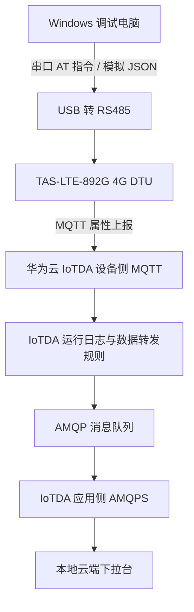

本文记录塔石 TAS-LTE-892G 4G DTU 通过 RS485 接入本地调试工具，并与华为云 IoTDA 完成 MQTT 属性上报和 AMQPS 消息下拉的完整实践

<!-- more -->
## 项目目标

通常配置、串口响应、网络状态、云端规则和下行订阅分散在多个工具中。这个项目把关键流程收敛成两个本地应用：

1. **设备调试台**：负责 USB 转 RS485 串口、AT 指令、DTU MQTT 配置、GPS/LBS、属性数据模拟。
2. **云端下拉台**：负责华为云 IoTDA 应用侧 AMQPS 队列订阅、运行日志解析和数据展示。

最终闭环是：RS485 串口可控、DTU 正确连云、温度和位置属性可上报、IoTDA 规则可转发、AMQPS 客户端可收到并解析消息。

## 整体架构

下面的图采用竖向布局，方便在导出 PDF 时完整保留链路。



设备调试台与云端下拉台刻意拆成两个服务，默认端口分别为 `8010` 和 `8011`。这样串口控制和 AMQPS 消费互不阻塞，现场可以同时查看模块状态和云端反馈。

## 数据模型设计

IoTDA 产品模型中定义服务，例如 `env_monitor`。温度为基础数值，位置定义为结构体，而不是将经纬度、基站编号、地址等信息平铺成大量顶层属性。

```json
{
  "services": [
    {
      "service_id": "env_monitor",
      "properties": {
        "temperature": 26.8,
        "location": {
          "longitude": 114.1694,
          "latitude": 22.3193,
          "timestamp": 1783589379
        }
      }
    }
  ]
}
```

位置结构体可以自然扩展出 `lac`、`cell_id`、`radius`、`addr`、`raw` 等字段，既适合当前的基站定位，也不会限制后续接入 GNSS 或其他定位源。

## 技术选型

| 技术 | 作用 | 选择原因 |
| --- | --- | --- |
| FastAPI + Uvicorn | 本地 HTTP API 与 Web 页面服务 | 轻量、异步友好，适合串口和前端接口并存 |
| pyserial | USB 转 RS485 串口收发 | Windows 串口支持稳定，接口直接 |
| HTML/CSS/JavaScript | 本地操作界面 | 无需复杂桌面 UI 框架，适合快速迭代调试面板 |
| WebSocket | 实时展示 RX/TX、状态和日志 | 串口读线程可将事件实时推到浏览器 |
| python-qpid-proton | AMQPS 消费者 | 支持 TLS、SASL PLAIN 和 AMQP receiver |
| pywebview | Windows 桌面窗口壳 | 复用本地 Web 页面，同时保留 EXE 使用体验 |
| PyInstaller | Windows EXE 打包 | 便于在无 Python 环境的调试电脑上使用 |

开发环境为 Windows + Anaconda Python 3.12。桌面版另外依赖 Microsoft Edge WebView2 Runtime（Windows 10以上自带）。

## 源码结构与职责

| 文件 | 主要职责 |
| --- | --- |
| `web_app.py` | 设备调试台后端：串口管理、AT 命令、DTU 配置队列、GPS/LBS、数据模拟、WebSocket |
| `cloud_pull_app.py` | 云端下拉台后端：AMQPS 配置、订阅启停、消息缓存读取、运行配置自动重启 |
| `huawei_amqps_app_service.py` | Proton AMQP receiver：TLS、SASL 登录、队列 receiver、JSONL 消息持久化 |
| `credential_files.py` | 解析华为云导出的设备连接和 AMQP AccessKey `.txt/.json` 文件 |
| `static/index.html` / `static/app.js` | 设备调试台页面、表单、命令库、GPS、模拟数据和实时日志 |
| `static/cloud_pull.html` / `static/cloud_pull.js` | 云端下拉页面、凭据选择、队列状态、消息展示和关于页 |
| `desktop_*.py` | WebView2 桌面启动器，启动 FastAPI 后打开本地窗口 |
| `*_console.spec` | PyInstaller 定义，包含 OpenSSL DLL 和 Web 静态资源 |

## 源码环境如何跑起来

### 准备 Python 环境

项目使用的 Anaconda 环境为 `myenv312`。以下命令以当前环境路径为例：

```powershell
$Py = 'E:\AnacondaFix\envs\myenv312\python.exe'
& $Py -m pip install -r requirements.txt
```

依赖定义在 `requirements.txt`，包括 FastAPI、Uvicorn、pyserial、python-qpid-proton、pywebview 和 PyInstaller。

### 启动设备调试台

在项目根目录执行：

```powershell
$Py = 'E:\AnacondaFix\envs\myenv312\python.exe'
& $Py -m uvicorn web_app:app --host 127.0.0.1 --port 8010
```

浏览器打开 `http://127.0.0.1:8010`。也可以使用项目中的 `start_web_myenv312.ps1`。

### 启动云端下拉台

另开一个终端：

```powershell
$Py = 'E:\AnacondaFix\envs\myenv312\python.exe'
& $Py -m uvicorn cloud_pull_app:app --host 127.0.0.1 --port 8011
```

浏览器打开 `http://127.0.0.1:8011`。也可以使用 `start_cloud_pull_myenv312.ps1`。若需要两个服务同时启动，可使用 `start_all_services_myenv312.ps1`。

源码模式下，真实配置会保存在本地 `tas_lte_892g_web_config.json` 和 `huawei_amqps_config.json`。这两个文件以及华为云导出的连接文件都不应提交到 Git。

## 设备调试台的实现细节

### 串口读取、写入与实时状态

后端通过 `pyserial` 打开 COM 口，以独立线程持续读取串口字节。读取缓冲区按换行拆分为文本行后，会同时完成三件事：

1. 发布 WebSocket 事件，使页面实时显示 RX 内容。
2. 解析 `+CSQ`、`+ASKNET`、`+ASKCONNECT`、`+GPS` 等回复，更新信号、驻网、连接和定位状态。
3. 写入命令等待队列，供“发送并等待回复”接口判断 `OK`、`ERROR` 或超时。

页面与串口不是直接连接，而是由 FastAPI 统一管理。这样浏览器刷新不会影响实际串口会话，也可以避免多个页面同时抢占 COM 口。

### 为什么 AT 命令前必须发送 `+++`

DTU 在透传模式下会把串口收到的普通文本当作业务数据发送给服务器。要执行 AT 命令，必须先退出透传模式：

```text
保护时间 -> +++（不带 CRLF）-> 等待模块切换 -> AT 命令
```

命令库的发送接口在后端执行这个序列。`+++` 模板本身不再重复发送；网络状态查询完成后会发送 `ATO` 回到透传模式。这样既能执行配置，也不会把状态查询指令误上报到云端。

### DTU MQTT 参数如何生成

设备连接文件中通常包含 `hostname`、`clientId`、`username`、`password`、`port` 和协议类型。前端选择文件后使用浏览器 `File.text()` 读取内容，并通过本机 HTTP API 交给 `credential_files.py` 校验 JSON 字段。

导入后，设备调试台生成 TAS-LTE-892G 对应的配置命令，例如：

```text
AT+IPPORT="<mqtt-host>",1883,1
AT+CLIENTID="<client-id>",1
AT+USERPWD="<username>","<password>",1
AT+MQTTPUB=1,"$oc/devices/<device-id>/sys/properties/report",0,0,1,1
```

华为云导出文件通常标注设备侧 `MQTTS:8883`。如果当前 DTU 固件没有 TLS 配置能力，不能直接把裸 MQTT 透传接到 `8883`；本工具默认提示并使用设备侧 MQTT `1883` 进行现场验证。

### 配置导入、命令预览与结果判定

“导入连接文件”不依赖固定文件路径。浏览器通过文件选择框读取用户选定的 `.txt` 或 `.json`，将文件名和文本内容提交给本机后端；后端再按 JSON 结构提取连接字段。导入完成后，界面会分别提示已填入的字段、连接文件未提供的字段，以及 `MQTTS:8883` 与 DTU 裸 MQTT 能力不匹配时的处理说明。

每次编辑 Host、设备 ID、Topic 或认证参数时，页面会同步刷新三种预览：认证三元组、准备上报的属性 JSON 和 AT 配置队列。这样用户在真正写入 DTU 前即可检查参数展开后的结果。

命令库的数据结构包含命令分类、查询/设置模板、是否带 CRLF、用途说明与回复含义。点击发送后，后端执行进入 AT 模式、发送目标命令、收集串口返回行这一完整事务；页面将 `+++` 的响应、命令原文、实际回复和含义并排展示。回复中出现 `OK`、`ERROR`、超时或没有返回时，状态卡和实时日志会显示不同结果，而不是只留下原始串口文本。

### GPS/LBS 与数据模拟

模块通过 `AT+GPS` 返回 LAC 和 CellId。工具把原始小区信息保留下来，只有用户主动点击“调用 API 解析经纬度”时才调用第三方基站定位接口，避免周期查询产生额外费用。

数据模拟页会把温度、定位结果和时间戳组装成 IoTDA 属性上报 JSON，再通过已经进入透传模式的串口发送给 DTU。这样可以把产品模型、DTU MQTT 参数和云端规则分开验证。

GPS 查询与基站 API 解析是两个独立动作：定时查询只发送 AT 命令并刷新 LAC、CellId、运营商等免费原始信息；调用付费 API 必须由用户点击确认，解析成功后才把 WGS84 经纬度回填到上报表单。没有定位结果时，调试台使用本次运行随机生成的模拟坐标，不会携带开发者的固定位置。

数据模拟的“开始定时发送”由浏览器维护单一计时器，开始后按设置的秒数调用一次本机 `/api/serial/send-payload`，再次点击即暂停并清除计时器。单次发送、定时发送和“微调数据”共用同一个 JSON 构造逻辑：温度每次微调增加 `0.2`，经纬度各增加 `0.0001`，便于确认云端收到的是新一条属性而非缓存结果。

### 一键连云和现场状态闭环

“启动云连接”将原本分散的现场步骤放进后台工作线程：检查并打开指定 COM 口、写入 MQTT 配置队列、等待模块注册、可选发送一条测试属性、进入 AT 模式查询 `AT+ASKNET?`、`AT+ASKCONNECT?`、`AT+CSQ`，最后使用 `ATO` 返回透传模式。长耗时串口操作不阻塞 FastAPI 的事件循环，因此页面在执行期间仍可接收状态更新。

后端把当前操作、进度、最后一次 TX/RX、最近 AT 结论、主网状态、MQTT 连接状态、信号强度和最近上报 JSON 汇总成设备状态快照；前端通过 WebSocket 接收实时日志，并按固定间隔拉取快照更新总览卡片。这样“串口打开成功”“配置指令已发送”“模块已驻网”和“属性 JSON 已发出”都能在页面上直接确认。

## 华为云 IoTDA 配置

### 创建产品、服务与设备

1. 搜索并进入设备接入 IoTDA。
2. 开通或试用服务。
3. 创建 IoTDA 实例。
4. 等待实例创建完成。
5. 创建产品。
6. 定义产品模型和服务。
7. 添加温度与位置属性。


8. 注册设备。
9. 设备标识可通过调试台命令库查询。
10. 完成设备注册。
11. 在设备详情中下载连接文件。其扩展名通常是 `.txt`，实际内容为 JSON。

### 导入连接文件并配置 DTU

设备调试台的“云配置”页可以选择任何对应设备的连接 `.txt/.json` 文件，并自动填入 MQTT Host、Device ID、ClientID、Username、Password、发布 Topic 和订阅 Topic。


保存配置后，预览 AT 队列并一键下发到模块。

随后从首页启动云连接。

在数据模拟页发送温度和位置数据，验证设备属性上报。

## 云端下拉台与 AMQPS 的实现

### IoTDA 运行日志到 AMQP 队列

在 IoTDA 的“数据转发”页面创建 AMQP 消息队列。

再打开“运行日志”，完成一键配置。该过程会创建 LTS 日志组、日志流、结构化数据和运行日志流转规则。

回到数据转发规则列表，确认运行日志规则已经启用。

打开 AMQP 队列并绑定运行日志规则。

这条链路的含义是：设备属性上报先由 IoTDA 接收，再形成 `device.property` 类型运行日志，最后进入 AMQP 队列。因此队列中的消息包含云平台处理结果和原始属性请求，适合用于现场追踪。

### 应用侧 AMQPS 登录

在“接入信息”页获取应用侧 AMQPS Host、端口和 AccessKey 文件。


云端下拉台选择 AccessKey 文件后，只导入 `access_key` 和 `access_code`。Host、队列名和实例 ID 属于当前 IoTDA 实例与队列配置，需要按控制台信息填写；实例 ID 不能误填为队列 ID。

AMQPS receiver 使用 Proton 建立 TLS 连接，并通过 SASL PLAIN 登录。用户名按 IoTDA 应用侧格式生成：

```text
accessKey=<AccessKey>|timestamp=<13 位毫秒时间戳>|instanceId=<IoTDA Instance ID>
```

密码为 AccessCode，receiver source 为 AMQP 队列名称。收到消息后，程序将原始记录追加到 `huawei_amqps_messages.jsonl`，并更新最新消息文件。Web 页面读取这些本地记录，继续解析嵌套的 `notify_data.body.log` 和其中的属性上报 JSON，提取温度、经纬度、服务 ID、设备 ID 和请求结果。


### 为什么要比较运行配置

AMQPS 消费者在启动时会持有 Host、队列、实例 ID、AccessKey 和 AccessCode 的快照。仅在页面保存新参数并不会修改已经运行的 receiver。

新版下拉台在点击“启动订阅服务”时会比较当前页面配置与后台运行配置：

- 参数一致：保持现有连接，避免重复创建消费者。
- 参数变化：停止旧订阅线程，按最新参数自动重启。

状态卡显示的是后台实际运行的 Host 和队列，而不是仅显示输入框内容。这能避免切换 IoTDA 产品或队列时误以为配置已生效。

## Windows 桌面打包与发布

桌面版流程为：pywebview 启动本地 Uvicorn 服务，自动寻找可用端口，然后使用 Edge WebView2 加载 `http://127.0.0.1` 页面。若默认端口被占用，程序会选择后续空闲端口。

打包命令：

```powershell
.\build_windows_exe_myenv312.ps1
```

PyInstaller 打包时显式携带 Anaconda 环境中的 `libssl-3-x64.dll` 与 `libcrypto-3-x64.dll`，并通过 runtime hook 在启动阶段加入 DLL 搜索路径，解决 `_ssl.pyd` 在单文件 EXE 中无法加载 OpenSSL 的问题。

发布版不会嵌入本地 `tas_lte_892g_web_config.json` 或 `huawei_amqps_config.json`，仓库只保留无密钥 `*.example.json`。执行下面脚本可生成源码包和 Windows 包：

```powershell
.\package_release.ps1
```

## 项目开源仓库
项目开源仓库：[tas-lte-892g-huawei-iotda-debug](https://github.com/ORI2333/tas-lte-892g-huawei-iotda-debug)