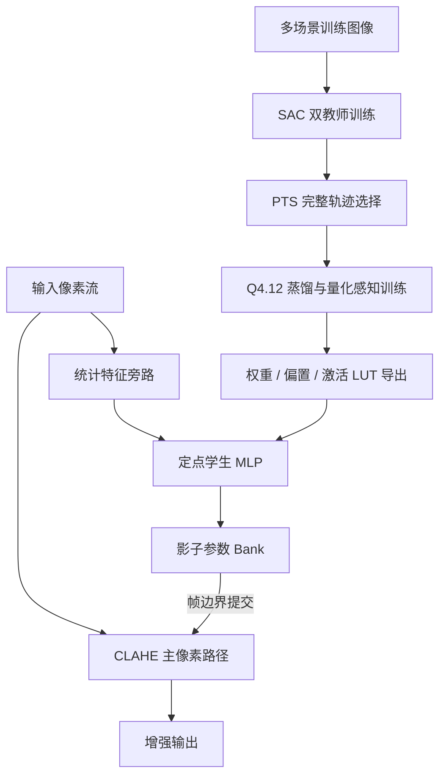

## 摘要

对比度受限自适应直方图均衡化（Contrast-Limited Adaptive Histogram Equalization，CLAHE）常用于工业视觉和嵌入式成像。其核心参数 Clip Limit 决定局部细节增强与噪声抑制之间的平衡：阈值过大容易放大噪声、破坏自然场景统计；阈值过小则难以恢复暗部纹理。固定 Clip Limit 在经过人工调参的单一场景中可以表现良好，但面对低照度、雾霾、过曝和连续光照变化时，参数缺乏适应性。

本项目实现了一套面向 FPGA 部署的感知驱动自适应 CLAHE 方案。离线侧将 Clip Limit 调节建模为有限时域马尔可夫决策过程，使用 Soft Actor-Critic（SAC）训练策略；全观测教师利用 BRISQUE、NIQE 等无参考图像质量评价（NR-IQA）作为特权信息，部分观测教师只使用硬件可获得的低维统计量。后验轨迹选择（Posterior Trajectory Selection，PTS）从两类教师生成的完整轨迹中筛选监督信号，再通过 Q4.12 量化感知蒸馏导出可直接初始化 FPGA ROM/LUT 的学生网络。

硬件侧采用单时钟域、流式像素架构。CLAHE 主路径与特征提取、学生网络推理、参数更新旁路解耦；主路径在活动视频区保持每周期一个有效像素，控制器仅在帧边界提交新的 Clip Limit。通过 ROM 常数倒数消除动态除法，并将二维双线性插值拆分为两级一维定点流水线，避免控制逻辑进入像素关键路径。完整设计在 Xilinx Kintex-7 XC7K325T 上完成 RTL 和实现验证。

| 项目项  | 内容                                                                                                                                                      |
| ---- | ------------------------------------------------------------------------------------------------------------------------------------------------------- |
| 项目名称 | 基于 SAC 双教师蒸馏的自适应 CLAHE 轻量化 FPGA 实现                                                                                                                      |
| 项目角色 | 独立开发                                                                                                                                                    |
| 开发周期 | 2025 年 1 月—2025 年 11 月                                                                                                                                  |
| 平台   | Xilinx Kintex-7 XC7K325T                                                                                                                                |
| 项目仓库 | [ORI2333/rl-clahe-fpga-artifact](https://github.com/ORI2333/rl-clahe-fpga-artifact)                                                                     |
| 论文   | [Stall-Free Software–Hardware Co-Design for Perception-Driven Contrast-Limited Adaptive Histogram Equalization](https://dl.acm.org/doi/10.1145/3847669) |
| 期刊   | ACM Transactions on Embedded Computing Systems                                                                                                          |
| 等级   | CCF B类、SCI                                                                                                                                              |

<!-- more -->

## 1. 引言

CLAHE 将图像划分为若干 tile，在 tile 内构建直方图、裁剪超过阈值的计数、重新分配溢出部分并计算累积分布函数（CDF）。像素映射由所属 tile 及其相邻 tile 的映射表经双线性插值得到，从而降低块状伪影。

在传统软件实现中，Clip Limit 通常由经验设定。工程上常见的做法是选一个在平均样本上表现尚可的常数，然后固定使用。这个选择并不错误：论文中的固定参数扫描显示，固定 CLAHE 在测试集上本身就是很强的基线。但其问题也很明确：不同场景对增强强度的需求不同，单个固定值无法同时覆盖平均质量、严重退化样本和动态光照场景。

如果直接把深度图像质量评价模型放入 FPGA 数据通路，代价不可接受。BRISQUE、NIQE 一类 NR-IQA 指标适合离线训练、模型选择和结果分析，不适合在高速像素流中逐帧、逐像素计算。另一方面，即使控制网络足够小，也不能让它阻塞视频光栅流；像素主路径出现一个 bubble 或 backpressure，就会破坏 `II = 1` 的吞吐假设。

该工作的约束由此确定：

1. 活动视频区的主像素路径必须持续一拍一个有效像素；
2. 部署侧策略只能使用硬件可观测的流式统计量；
3. 参数只能在明确的更新边界提交，保证同一帧内参数一致；
4. 离线训练、量化导出与 RTL 推理必须遵守同一套数值规则。

论文的重点不是用学习方法替换 CLAHE，而是把离线可获得的感知质量引导，转化为板端可执行、不会破坏流水线时序的控制器。

## 2. 总体软硬件协同方案

整个系统分为离线学习、在线推理和 FPGA 数据通路重构三个阶段。

离线阶段的教师可以利用丰富但不可部署的信息寻找更好的 Clip Limit 轨迹。在线阶段只保留从像素流中可以实时获得的低维特征，并使用定点学生 MLP 产生参数增量。CLAHE 主路径始终读取活动参数 Bank；控制器在后台计算并写入影子 Bank，帧边界仅执行一次恒定延迟的 Bank Select 切换。

这种组织方式将“感知质量优化”和“像素节拍保证”放在两条不同的路径上处理。控制器的执行时间被限制在一个帧周期内，不参与每个像素的组合关键路径。

## 3. 方法

### 3.1 控制目标与时间尺度

控制量为 Clip Limit 的连续增量。设当前帧参数为 $CL_t$，学生网络输出为 $y_t$，则执行的更新为：

$$
CL_{t+1}=\operatorname{clip}\left(CL_t+\Delta CL_{\max}\tanh(y_t),\ CL_{\min},\ CL_{\max}\right)
$$

论文中使用 $CL_{\min}=0.1$、$CL_{\max}=20.0$ 和 $\Delta CL_{\max}=2.0$。`tanh` 将网络输出约束为有界增量，`clip` 对应 FPGA 中的饱和逻辑。Clip Limit 寄存器采用 Q4.12 格式。

决策时域设为五步。这里的“五步”不是对同一帧重复五次图像增强：硬件中每帧只进行一次 CLAHE，通过帧边界提交一次新参数，因此五步对应连续五帧的渐进调整。离线训练用静态图像迭代五次来近似短时间窗口内场景统计量近似不变的情况。

这一选择带来了明确边界：同一帧内发生的突发照度变化，需要等到下一帧边界后才能被控制器反映。该延迟是为了换取帧内参数一致性和主路径无停顿，而不是实现缺陷被忽略。

### 3.2 非对称观测与 MDP 建模

CLAHE 参数调节建模为有限时域 MDP：

$$
\mathcal{M}=(\mathcal{S},\mathcal{A},\mathcal{R},\gamma,N_{\text{step}})
$$

部署状态只包含 FPGA 可计算的五维向量：

$$
s_t^{\text{lite}}=[\mu_t,\sigma_t^2,H_{2,t},CL_t,\hat{t}]\in\mathbb{R}^{5}
$$

其中：

- $\mu_t$：归一化均值；
- $\sigma_t^2$：归一化方差；
- $H_{2,t}$：二阶 Rényi 熵；
- $CL_t$：当前 Clip Limit；
- $\hat{t}=t/N_{\text{step}}$：归一化决策步数。

全观测教师在此基础上额外输入 BRISQUE 和 NIQE：

$$
s_t^{\text{rich}}=[s_t^{\text{lite}},Q_{\text{BRISQUE},t},Q_{\text{NIQE},t}]\in\mathbb{R}^{7}
$$

这里的差异是刻意保留的。BRISQUE、NIQE 只作为离线训练期的特权信息，学生网络不试图在 FPGA 上重建这些指标。蒸馏的目标是让只看五维状态的学生，学习到由感知质量引导过的动作序列。

选择 SAC 的原因在于动作空间本身是连续的。将 $[-2,2]$ 的更新量粗略离散为少量档位会造成显著的参数量化误差：保存的教师轨迹诊断表明，9 档离散动作的最终 Clip Limit 误差 P95 为 0.604；若要降至 0.072，需约 65 档动作。连续控制更符合 Clip Limit 小步调节的形式。

奖励以 BRISQUE、NIQE 的改善为主，同时加入锐度、对比度的辅助 shaping、动作幅度惩罚、相邻动作平滑惩罚和终止项。终止项针对少量严重劣化和过大的累计更新量施加约束。训练的主要目标仍是最小化五步结束时的 BRISQUE：

$$
Q_{\text{final}}\triangleq Q_{\text{BRISQUE},t=N_{\text{step}}}
$$

### 3.3 SAC 双教师与后验轨迹选择

两个教师分别处理不同的信息条件：

| 教师 | 输入状态 | 职责 |
| --- | --- | --- |
| Oracle Teacher | $s_t^{\text{rich}}$ | 使用 NR-IQA 特权信息，提供感知质量上界参考 |
| Robust Teacher | $s_t^{\text{lite}}$ | 仅使用部署可见信息，提供硬件可执行的稳健基线 |

Rich Teacher 并不是部署模型；Robust Teacher 也不是简单的降级版本。前者能避免仅依靠统计量时可能出现的感知退化，后者则直接暴露观测缺失带来的能力边界。两个教师在不同场景下并不稳定地互相支配，因此不预先指定某一类教师为“唯一正确答案”。

PTS 的处理方式是：对于每个训练图像，两名教师各自 rollout 一条完整五步轨迹 $\tau^{k}_{\text{rich}}$ 与 $\tau^{k}_{\text{lite}}$，在终点计算最终质量，再保留完整轨迹中质量更优的一条：

$$
\tau^{k}_{\text{best}}=\arg\min_{\tau\in\{\tau^{k}_{\text{rich}},\tau^{k}_{\text{lite}}\}}Q_{\text{final}}(\tau)
$$

PTS 不是运行时模块，也不是每一步从两个动作中挑一个拼接。逐步拼接会破坏轨迹的时序一致性，并放大参数振荡。学生蒸馏数据只保留部署可见状态和被选中轨迹对应的动作：

$$
\mathcal{D}=\{(s_t^{\text{lite}},a_t^*)\}
$$

这样，NR-IQA 的作用被限制在离线监督，不会引入不可部署的板端依赖。

### 3.4 Q4.12 量化感知蒸馏

学生网络使用 `5 → 128 → 64 → 1` 的 MLP，仅保留输出 Clip Limit 增量的动作头。任何训练期辅助头均不导出到 FPGA。

量化感知训练不是在浮点模型训练完成后附带做一次压缩。训练前向传播中就使用 Q4.12 参数量化、定点截断与饱和规则，以及与 RTL 一致的 `tanh` PWL/LUT 近似：

$$
\hat{a}_t=T\bigl(Q(y_t)\bigr)\cdot\Delta CL_{\max}
$$

其中 $Q(\cdot)$ 是 Q4.12 量化器，$T(\cdot)$ 是硬件可实现的 `tanh` 查表或分段线性近似。蒸馏损失为动作标签与定点学生输出的 $L_1$ 距离：

$$
\mathcal{L}_{\text{distill}}(\theta)=\mathbb{E}_{\mathcal{D}}\left[|\hat{a}_t-a_t^*|\right]
$$

导出阶段生成权重、偏置、归一化常数和激活查找表的 ROM 初始化文件。训练与推理共享数值定义，避免浮点软件模型、后量化模型和 RTL 之间出现不同的舍入、饱和或激活行为。

## 4. FPGA 架构与无停顿实现

### 4.1 主路径与控制旁路

在线架构逻辑上分为两条路径：

- **Pixel Main Path**：完成直方图更新、CDF 构建、CLAHE 映射和插值，处理当前帧；
- **Control Side Path**：对输入流降采样、提取统计量、运行学生 MLP，并准备下一帧的参数。

主路径从不等待控制路径。特征提取通过并行计数器和 BRAM 端口读取输入流，不对主路径施加 backpressure；学生 MLP 由独立 FSM 调度，只写影子寄存器和影子 LUT；两侧的唯一同步点是帧边界的 Bank 切换。对主像素通路而言，该切换只是一次常数延迟的 MUX 选择。

控制器 RTL 使用 SystemVerilog 实现，没有依赖 HLS。其硬件结构由流式特征模块、定点学生 MLP 和帧边界提交接口组成。控制 FSM 负责 `load → launch → wait → accumulate → commit` 五个阶段，完成每步动作更新和参数提交。

### 4.2 硬件可观测特征提取

控制旁路首先将输入流缩放为 `320 × 240` 代理流。缩放模块使用双口 BRAM 行缓存和 DSP48E1，实现定点双线性采样；横纵比例因子以 Q16.16 预计算，采样坐标由累加器生成，因此可以把不同输入分辨率映射到固定规模的统计代理图。

均值和方差通过单遍扫描计算。模块维护一阶矩 $S_1=\sum x_i$ 与二阶矩 $S_2=\sum x_i^2$，在垂直消隐期使用流水除法器计算：

$$
\mu=\frac{S_1}{N_{\text{pix}}},\qquad
\sigma^2=\frac{S_2}{N_{\text{pix}}}-\mu^2
$$

熵特征不直接使用 Shannon 熵。Shannon 熵要求对每个直方图 bin 计算对数，在 FPGA 上意味着较大的 LUT 开销或多周期迭代。实现改用二阶 Rényi 熵：

$$
H_2=2\log_2N_{\text{pix}}-\log_2\left(\sum_i c_i^2\right)
$$

其中 $c_i$ 为灰度直方图计数。该形式将对数移到求和之外，硬件只需累计计数平方和并完成一次基于 CORDIC 的对数计算。它与 Shannon 熵有较高相关性，且不需要额外帧缓存。

### 4.3 定点学生 MLP

学生网络输入为五维状态，网络结构为 `5 → 128 → 64 → 1`。权重与偏置均以 Q4.12 常量存入 ROM；隐藏层输出存入小型双口 RAM；乘加映射到 DSP48。隐藏层采用 ReLU，输出层由 `tanh` 的 PWL/LUT 近似生成有界动作。

MAC 阵列采用折叠计算，不需要为每个神经元完全展开乘法器。论文原型为每次帧更新预留 800 个周期，控制计算发生在当前帧期内，结果在后续帧边界生效。

### 4.4 双缓冲参数提交

活动 Bank 保存当前帧的 Clip Limit 与映射表控制信息；影子 Bank 用于接收控制器的新输出。当前帧内，CLAHE 主路径只读取活动 Bank，控制器可在影子 Bank 中更新参数和相关映射表。到达帧边界后，Bank Select 翻转，新参数对下一帧统一生效。

该协议避免了一个帧前半段使用旧阈值、后半段使用新阈值的情况。帧内一致性对局部直方图增强很重要，也使控制路径的可变执行时间不会传递到像素节拍。

### 4.5 CLAHE 主路径重构

#### 4.5.1 流式分块与上下文缓存

直接的 CLAHE 硬件映射通常先按整帧划分 tile，再为所有 tile 保存局部直方图和 CDF。高分辨率下，这会使缓存和控制复杂度随图像尺寸增长。

本实现根据行、列计数器实时得到当前像素的相邻块索引，只保留支持 `3 × 3` 上下文的少量行缓存。直方图更新、CDF 生成和像素映射随光栅扫描并行进行，不需要整帧缓存。计算核心因此对分辨率相对不敏感，分辨率变化主要影响行缓存深度和 BRAM 的工具映射。

#### 4.5.2 常数倒数消除除法

标准 CLAHE 映射包含归一化除法：

$$
T(g)=\frac{\operatorname{CDF}(g)-\operatorname{CDF}_{\min}}{N_{\text{block}}-N_{\text{clip}}}(L-1)
$$

对给定相机分辨率和 tile 配置，分母可视为常数。实现预先搜索常数除数 $D$ 对应的整数乘数 $M$ 与移位量 $k$，使：

$$
\left\lfloor\frac{n}{D}\right\rfloor\approx\left\lfloor\frac{nM}{2^k}\right\rfloor
$$

运行时映射为：

$$
T(g)\approx\bigl(\operatorname{CDF}(g)-\operatorname{CDF}_{\min}\bigr)\cdot M_{\text{rom}}\gg k_{\text{rom}}
$$

$(M,k)$ 预计算后写入 ROM。数据路径中不再实例化动态除法器，关键路径和 DSP/Slice 占用随之降低。

#### 4.5.3 可分离定点双线性插值

四邻域 tile 的二维双线性插值直接实现时，需要多路乘法和较长组合路径。将其展开为横向、纵向两步：

$$
\begin{aligned}
R_1&=T_A(r)+\delta_x(j)\bigl(T_B(r)-T_A(r)\bigr)\\
R_2&=T_C(r)+\delta_x(j)\bigl(T_D(r)-T_C(r)\bigr)\\
I(i,j)&=R_1+\delta_y(i)(R_2-R_1)
\end{aligned}
$$

$\delta_x$、$\delta_y$ 使用 Q0.10 定点格式，由块布局对应的计数器和比较器生成。拆分后，每一级仅包含一次乘法和少量加减法，可以深度流水化。Vivado 实现中，该结构满足 100 MHz 的时序假设，并保持活动视频区 `II = 1`。

## 5. 实验设置

### 5.1 数据集与训练配置

实验集共 780 张图像，来自 Foggy Cityscapes、LOL 和 Dark Face 等公开数据集，人工筛除近重复样本与明显离群样本后，按场景划分如下：

| 场景 | 训练 | 验证 | 测试 | 总数 |
| --- | ---: | ---: | ---: | ---: |
| 低照度 | 200 | 20 | 20 | 240 |
| 过曝 | 50 | 5 | 5 | 60 |
| 夜景 | 68 | 7 | 7 | 82 |
| 室外 | 30 | 3 | 3 | 36 |
| 街景 | 100 | 10 | 10 | 120 |
| 室内 | 129 | 13 | 13 | 155 |
| 雾霾 | 73 | 7 | 7 | 87 |
| 合计 | 650 | 65 | 65 | 780 |

软件评测在原始图像分辨率上进行；FPGA 中仅控制旁路的特征流被缩放到 `320 × 240`，CLAHE 主路径仍处理原始分辨率像素流。

SAC 教师使用 Adam 训练，策略网络与价值网络学习率均为 $3\times10^{-4}$，折扣因子 $\gamma=0.99$。两名教师训练 $10^6$ 步，在约 $10^5$ 步后趋于稳定。学生网络在 Q4.12 约束下蒸馏 100 个 epoch，batch size 为 256；验证结果显示约第 80 个 epoch 取得较好的质量与定点一致性折中。

### 5.2 指标与基线

BRISQUE 与 NIQE 作为主要 NR-IQA 指标，均为越低越好。两者只用于离线教师训练、模型选择和评测，不在 FPGA 部署时计算。补充统计包括 Shannon 熵、RMS 对比度、平均梯度和局部对比度。

除均值外，论文引入失败敏感分布指标：P90、P95 与最差 10% 样本均值。对于 BRISQUE、NIQE，数值越大表示质量越差，因此上尾统计可以直接描述过增强、欠增强等严重退化的风险。

对比方法包括：

- 全局直方图均衡化（Global HE）；
- 固定参数 CLAHE；
- 基于均值、方差和 Rényi 熵的规则自适应 CLAHE；
- Adaptive Gamma Correction；
- Multi-scale Retinex（MSR）；
- 仅部分观测教师的 SAC Single-Teacher；
- 完整 DT–QAT 学生控制器。

规则自适应基线以归一化均值、方差、Rényi 熵得到难度分数，再线性映射到 Clip Limit 并饱和。该基线不需要训练，用于区分“采用任意自适应规则”与“使用感知引导蒸馏”的差异。

## 6. 实验结果

### 6.1 固定 Clip Limit 扫描

固定 CLAHE 是该实验中必须认真对待的强基线。下表列出 65 张测试图像上的扫描结果，所有 IQA 数值均为越低越好：

| 方法 | BRISQUE 均值 | BRISQUE P95 | BRISQUE 最差 10% | NIQE 均值 | NIQE P95 | NIQE 最差 10% |
| --- | ---: | ---: | ---: | ---: | ---: | ---: |
| 固定 CLAHE，`CL=1.0` | 23.75 | 34.76 | 36.76 | 3.74 | 4.82 | 4.88 |
| 固定 CLAHE，`CL=1.5` | 23.36 | 35.97 | 35.75 | 3.68 | 4.72 | 4.80 |
| 固定 CLAHE，`CL=2.0` | 23.52 | 34.35 | 35.29 | 3.65 | 4.74 | 4.84 |
| 固定 CLAHE，`CL=2.5` | 24.03 | 34.64 | 35.74 | 3.63 | 4.75 | 4.89 |
| 固定 CLAHE，`CL=3.0` | 24.48 | 34.72 | 35.98 | 3.61 | 4.79 | 4.93 |
| 固定 CLAHE，`CL=4.0` | 25.60 | 34.41 | 37.69 | 3.60 | 4.85 | 5.00 |
| DT–QAT | 23.39 | 32.40 | 33.79 | 3.59 | 4.74 | 4.72 |

扫描结果表明，没有固定参数同时占优。`CL=1.5` 的 BRISQUE 均值最好，而较大的 CL 对 NIQE 均值略有帮助；但是上尾质量并不随均值同步改善。DT–QAT 的均值与强固定基线接近，其主要收益是将 BRISQUE P95 降至 32.40，并将最差 10% 的 BRISQUE 均值降至 33.79。

### 6.2 总体指标与场景差异

相对于输入图像，DT–QAT 将 BRISQUE 均值从 29.67 降至 23.39，将 NIQE 均值从 4.13 降至 3.59。固定 `CL=2.0` 已经达到 BRISQUE 23.52、NIQE 3.65，因此这里不应把很小的均值差距包装为对固定 CLAHE 的全面替代。

规则自适应方法和全局直方图均衡化能显著提高部分对比度、梯度或熵统计，但 BRISQUE 明显变差。这说明过于激进的增强容易偏离自然场景统计并引入伪影。DT–QAT 的控制策略更倾向于回避过大的 Clip Limit，使结果保持较为保守的增强强度。

按场景看，DT–QAT 相较固定 `CL=2.0` 在低照度、街景、雾霾、夜景和小样本室外组上具有竞争力或更优的 BRISQUE；例如雾霾由 25.57 降至 22.58，夜景由 14.81 降至 12.89。它在过曝组上较差（23.27 上升至 28.93，$n=5$），在室内组也略差（16.00 上升至 16.71）。因此该控制器不是所有场景下都能取代手工调好的固定参数，而是针对难例上尾风险的一种部署可行的缓解方案。

### 6.3 消融实验

消融实验分别移除 Rich Teacher、PTS 与 QAT。均值指标如下：

| 配置 | BRISQUE 均值 ↓ | NIQE 均值 ↓ |
| --- | ---: | ---: |
| 去除 Rich Teacher | 23.01 | 3.61 |
| 去除轨迹选择 | 23.32 | 3.60 |
| 去除 QAT，后量化 | 23.54 | 3.65 |
| 完整 DT–QAT | 23.39 | 3.59 |

只看均值会得到错误结论：去除 Rich Teacher 的 BRISQUE 均值甚至更低。完整模型的设计目标并非只压低一个总体均值，而是减少困难样本的劣化风险。对应的尾部统计如下：

| 配置 | BRISQUE 标准差 | BRISQUE P90 | BRISQUE P95 | BRISQUE 最差 10% | NIQE 最差 10% |
| --- | ---: | ---: | ---: | ---: | ---: |
| 去除 Rich Teacher | 8.50 | 32.04 | 32.95 | 34.42 | 4.75 |
| 去除轨迹选择 | 7.64 | 31.95 | 32.39 | 33.93 | 4.77 |
| 去除 QAT，后量化 | 8.36 | 33.07 | 34.81 | 36.02 | 4.85 |
| 完整 DT–QAT | 7.73 | 32.00 | 32.40 | 33.79 | 4.72 |

Rich Teacher 的作用是利用特权 IQA 信息避免策略钻取单一统计指标；PTS 的作用是滤除质量较差的完整示范；QAT 对定点部署的影响最明显。若先训练浮点模型再量化，BRISQUE P95 会从 32.40 变为 34.81，最差 10% 均值从 33.79 变为 36.02。

### 6.4 主观结果

在低照度场景中，全局 HE 可以整体提亮，但会把平坦区域中的背景噪声一起放大；固定 CLAHE 对暗部纹理的恢复相对保守。DT–QAT 在代表性样本中能够提升暗部信息，同时抑制平坦区域的噪声放大。

在容易过曝的高亮度场景中，规则自适应方法可能因阈值设置刚性而导致高光裁剪。学习控制器会收敛到较小的 Clip Limit，避免进一步放大高光区域伪影。其代价是部分客观对比度提升被主动抑制，这与奖励中限制过增强的设计一致。

## 7. FPGA 资源与实时性

### 7.1 CLAHE 核与控制旁路资源

在 `2048 × 1200`、单通道配置下，CLAHE 增强核使用 19,518 LUT、11,618 个寄存器、13.5 个 BRAM Tile 与 89 个 DSP。增强核、特征提取旁路和学生 MLP 合并后的完整配置使用 41,199 LUT、29,860 个寄存器、25.5 个 BRAM Tile 和 486 个 DSP，位于 XC7K325T 的资源预算内。

控制器的压缩收益如下：

| 网络 | LUT | 寄存器 | BRAM Tile | DSP |
| --- | ---: | ---: | ---: | ---: |
| 原始 Actor | 34,994 | 33,566 | 61.0 | 577 |
| 学生 MLP | 17,514 | 9,953 | 11.5 | 385 |
| 相对下降 | 49.9% | 70.3% | 81.1% | 33.3% |

特征提取旁路额外使用 4,167 LUT、8,289 个寄存器、0.5 个 BRAM Tile 和 12 个 DSP，约占目标器件 LUT 资源的 2.04%。这部分资源用于获得逐帧自适应能力，且不进入 CLAHE 主像素路径。

不同分辨率下，流式核心的计算逻辑资源基本稳定；BRAM 会随行缓存宽度和工具的存储映射发生阶梯式变化。多通道配置的资源随通道数近似线性增长，因为每个通道有独立的直方图与插值数据通路，而控制结构可以共享。

### 7.2 与既有 FPGA CLAHE 的位置关系

跨论文的 LUT、BRAM、DSP 或帧率不能简单横向比较：不同工作使用不同 FPGA 系列、时钟、存储原语、输入分辨率、像素并行度和 CLAHE 变体。已有工作中，纯 CLAHE 主路径可以采用更高的像素并行度，实现例如 4K 60 FPS 的吞吐。

本设计选择的目标不同：不是只优化固定参数 CLAHE 的峰值吞吐，而是在保持主路径一像素/周期流式处理的前提下，加入特征提取与学习控制器，实现 Clip Limit 的闭环自适应。因此，论文中的跨工作对比用于说明资源和吞吐背景，不作为绝对性能优越性的结论。

### 7.3 布局布线、功耗与周期预算

集成 RTL 原型在 `640 × 480` 视频流诊断配置下完成布局布线后评估。目标时钟为 100 MHz，使用 33,676 LUT、28,960 个 FF、25 个 BRAM Tile 和 496 个 DSP。Vivado `report_power` 在默认/vectorless 活动模型下报告功耗 1.397 W，其中动态功耗 1.229 W、静态功耗 0.167 W。

| 项目 | 数值 |
| --- | ---: |
| 目标器件 | XC7K325T-2 |
| 时钟 | 100 MHz |
| 诊断时序 | 640 × 480 active / 800 × 525 raster |
| 功耗估算 | 1.397 W |
| 每活动帧能量 | 4.29 mJ |
| 每 raster 帧能量 | 5.87 mJ |
| 每像素能量 | 13.97 nJ |

上述功耗与能量来自工具报告和指定的活动假设，不应解释为板级实测结果。

100 MHz 单时钟域下，CLAHE 主路径在活动视频区维持一拍一个有效像素。相对直通路径，CLAHE 增加固定 44 周期延迟。控制旁路的缩放、统计特征提取约使用 96,200 个周期，学生 MLP 单帧更新预算为 800 个周期；二者并行于像素路径执行。

对 `2048 × 1200` 的 packed stream，若不计同一时钟域内的消隐和外部接口反压，`II=1` 对应的上限为：

$$
\frac{100\ \text{MHz}}{2048\times1200}=40.68\ \text{FPS}
$$

实际视频帧率还取决于接口 blanking 和外部链路。五步控制时域不增加每帧像素工作量：每帧只进行一次 CLAHE，控制器也只进行一次参数更新。

<!-- 可在此处补充：Vivado 资源、时序和功耗报告截图；或板端视频流诊断结果 -->

## 8. 讨论

当前设计优先保证部署可行性和帧内参数一致性，因此采用帧级更新。对于帧内突变光照，响应会延后至下一帧边界。RTL 中加入阈值触发的跨帧平滑器：当 Clip Limit 变化超过 256 个直方图计数单位时，将单帧变化限制为 128；在两个 30 帧视频诊断中，该保护分别触发 2/30 帧和 5/30 帧。它用于限制异常跳变，不代表系统已具备帧内即时自适应。

控制器目前只调节 Clip Limit。对于高纹理、强噪声的工业表面，自然场景统计类 NR-IQA 指标并不等价于缺陷可检测性。特征边缘更强、局部对比度更高，也不能直接推出缺陷检测更准确。若将该方法接入工业质检，应使用缺陷掩码、检测器精度、漏检率或任务相关的质量指标构造训练目标。

Artifact 中的工业纹理诊断也应按这一边界理解：规则自适应 CLAHE 会明显放大高频纹理和噪声；DT–QAT 相对规则方法更保守；在该特定工业样本上，固定 `CL=2.0` 仍是更保守的选择。该诊断没有使用缺陷掩码或下游检测器验证，因此不应被解释为工业检测精度结论。

## 9. 复现材料

项目 Artifact 仓库：<https://github.com/ORI2333/rl-clahe-fpga-artifact>

仓库提供：

- 评测、消融和统计脚本；
- Q4.12 学生网络导出与定点一致性检查工具；
- SystemVerilog 控制器、特征提取模块和代表性仿真入口；
- Vivado 时序、资源与功耗报告快照；
- 固定参数扫描、尾部统计、视频诊断和工业纹理诊断的派生结果；
- 复现计划、硬件验证说明和引用元数据。

受数据授权、实验环境和审稿材料限制，仓库不包含完整训练数据集、原始视频、原始工业图像、Bitstream、私有实验路径、论文源文件或审稿材料。

## 10. 结论

该工作完成了从离线感知引导到 FPGA 在线执行的闭环设计：双教师 SAC 使用 NR-IQA 学习控制轨迹，PTS 将两个教师的完整轨迹转化为部署可见状态上的监督样本，Q4.12 QAT 将学生网络对齐到 RTL 数值行为；硬件端以控制旁路、影子参数 Bank 和帧边界提交保证主路径无停顿。

在算法实现层面，ROM 常数倒数替代运行时除法，可分离定点插值替代直接二维插值，流式分块替代帧级缓存。在部署层面，学生控制器相对原始 Actor 降低约 49.9% LUT 与 81.1% BRAM；在质量层面，固定 CLAHE 已是强基线，DT–QAT 的主要价值在于保持竞争性均值的同时压低困难样本的尾部退化风险。

完整论文见：[Stall-Free Software–Hardware Co-Design for Perception-Driven Contrast-Limited Adaptive Histogram Equalization](https://dl.acm.org/doi/10.1145/3847669)。
